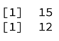
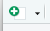
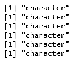
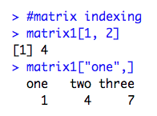
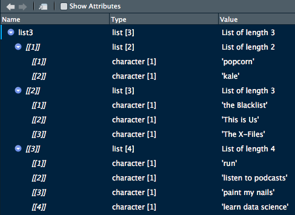

Lab 1. Introduction to R
-------------------------------------


One tool that statisticians---and now data scientists as well---often
use for data cleaning, analysis, and reporting is the R programming
language. 

In this lab, we\'ll begin by looking at the basics of using R as a
programming language and as a statistical analysis tool, and we\'ll also
install a few useful R packages that we will continue to use throughout
the course. 

By the end of this lab, you will be able to:


-   Install R packages for use throughout the course
-   Use R as a calculator for basic arithmetic
-   Utilize different data structures
-   Control program flow by writing if-else, for, and while loops
-   Import and export data to and from CSV, Excel, and SQL


Using R and RStudio, and Installing Useful Packages
--------------------------------------------------------------------


R is a programming language intended for
use for statistical analysis. Additionally,
it can be utilized in an object-oriented or functional way.
Specifically, it is an implementation of S, an interactive statistical
programming language. R was initially
released in August 1993. It is maintained today by the R Development
Core Team.

RStudio is an incredibly useful **Integrated Development Environment** (**IDE**) for writing and using R.
Many data scientists use RStudio for writing
R, as it provides a console window, a code editor, tools to help create
plots and graphics, and can even be integrated with GitHub to support
version control.

While R does share some functionality with Microsoft Excel, it allows
you to have more control over your data, and
you can add on a variety of packages that
allow statistical functionality out of the box---you won\'t have to
build a formula to conduct a survival analysis; you can
just install the survival package and use
that!


**Note:**

Ensure that you have R and RStudio installed on your system. RStudio
will not work if you don\'t have R installed on your machine; they must
be installed separately. Once they are both installed, you can open
RStudio and use that without having an R window open.


### Using R and RStudio


Out of the box, R is completely usable. Open R on your machine. Let\'s use R for some basic arithmetic
such as addition, multiplication,
subtraction, and division. The following screenshot demonstrates this:


It also provides functions such
as`sum()`and`sqrt()`for addition and calculation of
the square root. The following screenshot shows this in action:


R can---and will---do basic arithmetic like a calculator, using symbols
you\'re familiar with. One you may not have used before is exponentiate,
where you use two asterisks, for example, 4 \*\* 2, which you can read
as 4 to the power of 2.

Once you want to start doing math beyond
basic arithmetic, such as finding square
roots or summing many numbers, you have to start using functions.


#### Executing Basic Functions in the R Console


Let\'s now try and execute the
`sum()` and `sqrt()` functions in R. Follow the
steps given below:


1.  Open the R console on your system.
2.  Type the code as follows:


``` 
sum(1, 2, 3, 4, 5)
sqrt(144)
```


3.  Execute the code.


**Output**: The preceding code provides the following output:





Functions such as `sum()` and `sqrt()` are called
**base functions**, which are built into R. This means that
they come pre-installed when R is downloaded.

We could build all of our code right in the R console, but eventually,
we might want to see our files, a list of everything in our global
environment, and more, so instead, we\'ll use RStudio. Close R, and when
it asks you to save the workspace image, for now, click
**`Don't Save`**. (More explanation on workspace images and saving will
come later in this lab.)

Open RStudio. We\'ll use RStudio for all of our code development from
here on. One major benefit of RStudio is that we can use **`Projects`**,
which will organize all of the files for analysis in one folder on our
computer automatically. Projects will keep
all of the parts of your analysis organized in one space in a chosen
folder on your machine. Any time you start a new project, you should
start a new project in RStudio by going to **`File`** \|
**`New Project`**, as shown in the below screenshot, or by clicking the
new project button (blue, with a green plus sign


).


Creating a project from a **`New Directory`** allows us to create a
folder on our drive (here `E:\`) to store all code files,
data, and anything else associated with the course. If there was an
existing folder on our drive that we\'d like to make the directory for
the project, we would choose the **`Existing Directory`** option. The
**`Version Control`** option allows you to clone a repository from
GitHub or another version control site. It makes a copy of the project
stored on GitHub and saves it on your computer:


The working directory in R is the folder where all of the code files and
output will be saved. It should be the same as the folder you choose
when you create a project from a new or existing directory. To verify
the working directory at any time, use the `getwd()` function.
It will print the working directory as a character string (you can tell
because it has quotation marks around it). The working directory can be
changed at any time by using the following syntax:

``` 
setwd("new location/on the/computer")
```


To create a new script in R, navigate to **`File`** \| **`New File`** \|
**`R Script`**, as shown in the screenshot below, or click the button on
the top left that looks like a piece of paper with a green arrow on it





.


Inside **`New File`**, there are options to create quite a few different things that you might use in R. We\'ll
be creating R scripts throughout this course.

Custom functions are fairly straightforward to create in R. Generally,
they should be created using the following syntax:

``` 
name_of_function &lt;- function(input1, input2){
operation to be performed with the inputs
}
```


The example custom function is as follows:

``` 
area_triangle &lt;- function(base, height){
0.5 * base * height
}
```


Once the custom function code has been run, it will display in the
**`Global Environment`** in the upper right corner and is now available
for use in your RStudio project, as shown in the following screenshot:


One crucial step upon exiting RStudio or when
you close your computer is to save a copy of the global environment.
This will save any data or custom functions in the environment for later
use and is done with the `save.image()` function, into which
you\'ll need to enter a character string of what you want the saved file
to be called, for example, `introDSwR.RData`. It will always
be named with the extension `.RData`. If you were to open your
project again some other time and want to load the saved environment,
you use the `load()` function, with the same character string
inside it.


#### Setting up a New Project 


Let us now setup a new project that we will
use throughout the course. We will create an R project, script, custom
function, and save an image of the global environment. Follow the steps
given below:


1.  Open RStudio.
2.  Navigate to **`File`** \| **`New Project`** to start a new project:
    
    -   Start with a new directory and save it in a place on your
        computer that makes sense to you.
    -   Save the project with the name `IntroToDSwRCourse`.
    
3.  Check the working directory using the `getwd()` function
    and be sure it\'s the same folder you chose to save your project in.
4.  Start a new script. Save the script with the filename
    `lesson1_exercise.R`.
5.  Write a custom function, `area_rectangle()`, which
    calculates the area of a rectangle, with the following code:


``` 
area_rectangle &lt;- function(length, width){
length * width
}
```


6.  Try out `area_rectangle()` with the following sets of
    lengths and widths:
    
    -   5, 10
    -   80, 7
    -   48209302930, 4
    


The code will be as follows:

``` 
area_rectangle(5, 10)
area_rectangle(80, 70)
area_rectangle(48209302930, 4)
```


7.  Save an image of the global environment for later; name the file
    `introToDSwR.RData`.


**Output**: The output you get after executing the `getwd()` function will be the
folder on your computer that you have chosen to save your project in.

The area of the rectangle with different lengths will be provided as
follows:


R and RStudio will be our main tools throughout this course for
statistical analysis and programming. We\'ve now seen how to create a
new project, a new R script, and how to save a workspace image for use
later.


### Installing Packages


In this lab, we\'ve already seen some of
the base functions that are built into R. We also built a few custom
functions, `area_triangle()` and `area_rectangle()`,
in the last section.

Now, let\'s talk about packages. Anyone can write an R package of useful
functions and publish it for use by others.
Packages are usually made available on the **Comprehensive R Archive
Network** (**CRAN**) website, or
**Bioconductor**, a collection of packages for bioinformatics
and other uses. Both these sites conduct a thorough
review of submitted packages before
publishing them on their sites, so package developers often keep beta
versions of packages, or those that are useful but may not pass the
inspections, on GitHub.

RStudio makes installing packages very easy. There are two ways to do
so: either type `install.packages("package_name")` in a script
or your console, or you can navigate to the **`Packages`** tab in the
lower right window and click **`Install`**, which will show a window
that allows you to type the names of the
packages that are available on CRAN. You can even install multiple
packages if you separate them with a comma. You\'ll want to keep
**`Install dependencies`** checked, as this will install any packages
that the package you\'ve chosen depends on to run successfully---you\'ll
want those! Let\'s see this in the following screenshot:


Let\'s now use two different methods to install R packages. Follow these
steps:


-   Install the `survival` package using the following code:


``` 
install.packages("survival")
```


-   Install the `mice` package using the **`Install`** button
    on the **`Packages`** tab.


**Output**: The following should be displayed on your
console:


The same information should be displayed once
you install `mice`, with that package\'s name subbed in for
`survival`.

R and RStudio, plus its packages, are incredibly helpful data science
tools that will be the focus of this course. Now, let\'s get your project
for the course set up, and install a set of incredibly useful packages
called the `Tidyverse`, for use throughout the rest of this
course.


### Activity: Installing the Tidyverse Packages


**Scenario**

You have been assigned the task of developing a report using R. You need
to install the `Tidyverse` packages to develop that report.

**Aim**

To install `Tidyverse`, a set of useful packages
that will be used later in the course. Load the
inbuilt datasets into the project.

**Prerequisites**

Make sure that you have R and RStudio installed on your machine.

**Steps for completion**


1.  Install the `Tidyverse` package using the
    `install.package()` function.


2.  Load the `ggplot2` library and the built-in
    `msleep` dataset.


**Note:**

Note that `msleep` is a built-in dataset in the ggplot2
package. We\'ll use R built-in datasets throughout this course.


3.  Save the global image of the environment for use later use.


This activity was crucial. We\'ve added a dataset and the
`Tidyverse` packages to the project we intend to
use for the rest of the course. We\'ve also
saved a copy of our global environment to our working directory. The
`Tidyverse` packages, `dplyr`, `ggplot2`,
`tidyr`, and a few others, will be very helpful throughout
this course and in your data science work.


Variable Types and Data Structures
----------------------------------------------------


In this section, we\'ll begin first with an
exploration of different variable types: numeric, character, and dates.
We\'ll then look at different data structures
in R: vectors, lists, matrices, and data frames.


### Variable Types


Variable types exist in all programming
languages and will tell the computer how to store and access a variable.

First, know that all variables created in R will have a class and a
type. You can look at the class or type of anything in R using the
`class()` and `typeof()` functions, respectively.

The class of an object is a broad designation, for example,
`character`, `numeric`, `integer`, and
`date`. These are very broad categories, and type elaborates
more specifically on what type of variable it is, for example, a
variable of class `date` can be of type `character`
or `POSIXct`, depending on how it is stored. Type drills down
into the details of a variable and how it\'s been stored in R, though
sometimes class and type can be the same. For example, integers are of
class and type `integer`, and character strings are of type
and class `character`. Let\'s examine the following code
snippet:

``` 
x &lt;- 4.2
class(x)
typeof(x)
```


The preceding code provides the following output:


In this snippet, `x` has a class `numeric`, because
it is a number, but also has a type `double` because it is a
decimal number. This is because all numeric data in R is of type
`double` unless the object has been
explicitly declared to be an `integer`. Let\'s look at some
examples of different classes and types.


#### Numeric and Integers


The `numeric` data class includes
all numbers except integers, which are their own separate class in R.
Anything of class `numeric` will be of type
`double`, unless it is explicitly declared as an
`integer`. To create an `integer`, you must type a
capital letter, L, after a whole number.

Let\'s now create and check the `class()` and
`typeof()` of different numeric objects in R. Follow the steps
given below:


1.  Create the following numeric objects:


``` 
x &lt;- 12.7
y &lt;- 8L
z &lt;- 950
```


2.  Check the class and type of each using `class()` and
    `typeof()`, respectively, as follows:


``` 
class(x)
typeof(x)

class(y)
typeof(y)

class(z)
typeof(z)
```


**Output**: The preceding code provides the following output:


#### Character


Character data is always mentioned in
quotation marks; anything contained in quotation marks is called a
character string. Usually, character data is of both class and type
`character`.

Let\'s create and check the `class()` and
`typeof()` of different character objects in R. Follow the
steps given below:


1.  Create the following objects:


``` 
a &lt;- "apple"
b &lt;- "7"
c &lt;- "9-5-2016"
```


2.  Check the class and type of each using `class()` and
    `typeof()`, respectively, as follows:


``` 
class(a)
typeof(a)

class(b)
typeof(b)

class(c)
typeof(c)
```


**Output**: The preceding code provides the following output:





#### Dates


Dates are a special type of data in R, and are distinct from the date types `POSIXct` and
`POSIXlt`, which represent calendar dates and times in more
formal ways.

Let\'s create and check the `class()` and
`typeof()` of different date objects in R. Follow these steps:


1.  Create the objects using the following code:


``` 
e &lt;- as.Date("2016-09-05")
f &lt;- as.POSIXct("2018-04-05")
```


2.  Check the class and type of each by using `class()` and
    `typeof()`, respectively, as follows:


``` 
class(e)
typeof(e)

class(f)
typeof(f)
```


**Output**: The preceding code provides the following output:


One nice thing about R is that we can change objects from one type to
another using the `as.*()` function family. If we have a
variable, `var`, which currently has the value of 5, but as a
character string, we can cast it to numeric data type using
`as.numeric()` and to an integer using
`as.integer()`, which the following code demonstrates:

``` 
#char to numeric, integer
var &lt;- "5"

var_num &lt;- as.numeric(var)
class(var_num)
typeof(var_num)

var_int &lt;- as.integer(var)
class(var_int)
typeof(var_int).
```


Conversely, we can go the other way and cast the `var_num` and
`var_int` variables back to the `character` data
type using `as.character()`. The following code demonstrates
this:

``` 
#numeric, integer to char
var &lt;- 5

#numeric to char
var_char &lt;- as.character(var_num)
class(var_char)
typeof(var_char)

#int to char
var_char2 &lt;- as.character(var_int)
class(var_char2)
typeof(var_char2)
```


A character string can be converted into a `Date`, but it does
need to be in the format `Year-Month-Day (Y-M-D)` so that you
can use the `as.Date()` function, as shown in the following
code:

``` 
#char to date
date &lt;- "18-03-29"
Date &lt;- as.Date(date)
class(Date)
typeof(Date)
```


There are formatting requirements for dates
for them to save correctly. For example, the following code will not
work:

``` 
date2 &lt;- as.Date("03-29-18")
```


It will throw the following error:

``` 
Error in charToDate(x) : character string is not in a standard unambiguous format
```


It will be important to understand variable types throughout a data
science project. It would be very difficult to both clean and summarize
data if you\'re unsure of its type. In Lab 3, we\'ll also introduce another variable
type: `factors`.


### Activity: Identifying Variable Classes and Types


**Scenario**

You need to write some code for classifying
the data correctly for easy report
generation. The following is the provided data:


**Aim**

To identify different classes and types of data in R.

**Prerequisites**

A pencil or pen, plus RStudio and R installed on your machine.

**Steps for completion**


1.  Fill in the table provided with the class and type of each variable.
2.  Use the `class()` or `typeof()` functions if you
    get stuck, but first try and fill it in without the code!


### Data Structures


There are a few different data structures in
R that are crucial to understand, as they directly pertain to the use of
data! These include vectors, matrices, and dataframes. We\'ll discuss
how to tell the difference between all of these, along with how to
create and manipulate them.

Data structures are extremely important in R for manipulating,
exploring, and analyzing data. There are a few key structures that will
hold the different types of variables we discussed in the last
subsection, and more. R uses different words for some of these data
structures than other programming languages, but the idea behind them is
the same.


#### Vectors


A vector is an object that holds a collection
of various data elements in R, though they are limited because
everything inside of a vector must all belong to the same variable type.
You can create a vector using the method `c()`, for example:

``` 
 vector_example &lt;- c(1, 2, 3, 4)
```


In the above snippet, the method `c()` creates a vector named
`vector_example`. It will have a length of four and be of
class `numeric`. You use `c()` to create any type of
vector by inputting a comma-separated list of the items you\'d like
inside the vector. If you input different classes of objects inside the
vector (such as numeric and character strings), it will default to one
of them.

In the following code, we can see an example where the class of the
vector is a `character` because of the `B` in
position 2:

``` 
vector_example_2 &lt;- c(1, "B", 3)
class(vector_example_2)
```


**Output**: The preceding code provides the following output:


To access a certain item in the vector, you can use indexing. R is a
1-indexed language, meaning all counting starts at 1 (versus other
languages, such as Python, which are 0-indexed---that is, in Python, the
first element of the array is said to be at the 0th position).

The first item in a vector can be accessed using `vector[1]`,
and so on. If the index doesn\'t exist in the vector, R will simply
output an `NA`, which is R\'s default way of indicating a
missing value. We\'ll cover missing values in R at length in Lab 3.

Let us now use `c()` to create a vector, examine its class and
type, and access different elements of the vector using vector indexing.
Follow the steps given below:


1.  Create the vectors `twenty` and `alphabet` using
    the following code:


``` 
twenty &lt;- c(1:20)
alphabet &lt;- c(letters)
```


2.  Check the class and type of twenty and alphabet using
    `class()` and `typeof()`, respectively, as
    follows:


``` 
class(twenty)
typeof(twenty)

class(alphabet)
typeof(alphabet)
```


3.  Find the numbers at the following positions in `twenty`
    using vector indexing:


``` 
twenty[5]
twenty[17]
twenty[25]
```


4.  Find the letters at the following positions in the alphabet using
    vector indexing:


``` 
alphabet[6]
alphabet[23]
alphabet[33]
```


**Output**: The code we write will
be as follows:

``` 
twenty &lt;- c(1:20)
alphabet &lt;- c(letters)
class(twenty)
typeof(twenty)
class(alphabet)
typeof(alphabet)
twenty[5]
twenty[17]
twenty[25]
alphabet[6]
alphabet[23]
alphabet[33]
```


The output we get after executing it is as follows:


#### Lists


A list is different from a vector because it
can hold many different types of R objects inside it, including other
lists. If you have experience programming in another language, you may
be familiar with lists, but if not, don\'t worry! You can create a list
in R using the `list()` function, as shown in the following
example:

``` 
L1 &lt;- list(1, "2", "Hello", "cat", 12, list(1, 2, 3))
```


Let\'s walk through the elements of this list. First, we have the number
1. Then, a character string, \"2\", followed by the character string
\"Hello\", the character string \"cat\", the number 12, and then a
nested list, which contains the numbers 1, 2, and 3.

Accessing these different parts of the list that we just created is
slightly different---now, you are using list indexing, which means using
double square brackets to look at the different items. 

You\'ll need to enter `L1[[1]]` to view the number 1 and
`L1[[4]]` to see \"cat\".

To get inside the nested list, you\'ll have to use
`L1[[6]][1]` to see the number 1. `L1[[6]]` gets us
to the nested list, located at position 6, and `L1[[6]][1]`
allows us to access the first element of the nested list, in this case,
number 1. The following screenshot shows the output of this code:


Lists can also be changed into other data structures. We could turn a
list into a dataframe, but this particular list, because it contains a
nested list, will not coerce to a vector. The following code
demonstrates this:

``` 
L1_df &lt;- as.data.frame(L1)
class(L1_df)
L1_vec &lt;- as.vector(L1)
class(L1_vec)
```


The following screenshot shows the output of
this code:


#### Matrices


A matrix is a 2D vector with rows and
columns. In R, one requirement for matrices is that every data element
stored inside it be of the same type (all `character`, all
`numeric`, and so on). This allows you to perform arithmetic
operations with matrices, if, for example, you have two that are both
`numeric`.

Let\'s use `matrix()` to create a matrix, examine its class,
use `rownames()` and `colnames()` to set row and
column names, and access different elements of the matrix using multiple
methods. Follow the steps given below:


1.  Use `matrix()` to create `matrix1`, a 3 x 3
    matrix containing the numbers 1:12 by column, using the following
    code:


``` 
matrix1 &lt;- matrix(c(1:12), nrow = 3, ncol = 3, byrow = FALSE)
```


2.  Create `matrix2` similarly, also 3 x 3, and fill it with
    1:12 by row, using the following code:


``` 
matrix2 &lt;- matrix(c(1:12), nrow = 3, ncol = 3, byrow = TRUE) 
```


3.  Set the row and column names of `matrix1` with the
    following:


``` 
rownames(matrix1) &lt;- c("one", "two", "three") colnames(matrix1) &lt;- c("one", "two", "three")
```


4.  Find the elements at the following
    positions in `matrix1` using matrix indexing:


``` 
matrix1[1, 2]
matrix1["one",]
matrix1[,"one"]
matrix1["one","one"]
```


The output of the code is as follows:





#### Dataframes


A dataframe in R is a 2D object where the
columns can contain data of different classes and types. This is very
useful for practical data storage.

Dataframes can be created by using `as.data.frame()` on
applicable objects or by column- or row-binding vectors using
`cbind.data.frame()` or `rbind.data.frame()`.
Here\'s an example where we can create a list of nested lists and turn
it into a data frame:

``` 
list_for_df &lt;- list(list(1:3), list(4:6), list(7:9))
example_df &lt;- as.data.frame(list_for_df)
```


`example_df` will have three rows and three columns. We can
set the column names just as we did with the matrix, though it isn\'t
common practice in R to set the row names for most analyses. It can be
demonstrated by the following code:

``` 
colnames(example_df) &lt;- c("one", "two", "three")
```


We have covered a few of the key data structures in R in this section,
and we have seen how to create and manipulate them. Let\'s try a few
examples.


### Activity: Creating Vectors, Lists, Matrices, and Dataframes


**Scenario**

You have been asked to create vectors, lists, matrices, and dataframes that store
information about yourself. The expected output is as follows:





**Aim**

To create vectors, lists, matrices, and dataframes.

**Prerequisites**

Make sure that you have R and RStudio installed on your machine.

**Steps for Completion**


1.  Open a new R script and save it as a file called
    `lesson1_activityB2.R`.

2.  Create vectors for the following: 

    
    -   The numbers 1:10

    -   The letters A:Z, with the first four numbers and letters
        alternating
    


**Note:**

Hint: type `?LETTERS` into your console.


3.  Create lists for the following:
    
    -   The numbers 1:10
    -   The letters A:Z
    -   A list of lists:
        
        -   Your favorite foods (two or more)
        -   Your favorite TV shows (three or more)
        -   Things you like to do (four or more)
        
    
4.  Create matrices of numbers and letters by
    using the following steps:
    
    a.  First, try using `cbind()` to combine the vector 1:10
        and the vector A:Z. What happens?
    b.  Figure out a way to combine these two into a matrix, albeit one
        that will be coerced to character type (despite the numeric
        column).
    
5.  Create dataframes using the following
    steps:
    
    a.  Coerce your matrix solution from the
        previous second bullet point into a dataframe. View it and take
        note of the type of each variable.
    b.  Use `rbind.data.frame()` to build a data frame where
        the rows increase by five until 25, for example, 5, 10, 15,
        20, 25.
    c.  View it and notice how ugly the column names are. Give it better
        names (\"one\" through \"five\") with the `names()`
        function.
    


Basic Flow Control
------------------------------------


Flow Control includes different kinds of
loops that you can use in R, such as the `if/else`,
`for`, and `while` loops. While many of the concepts
are very similar to how flow control and loops are used in other
programming languages, they may be written differently in R.


**Note:**

Generally speaking, most loops are not considered best practice for
coding in R. Some alternatives to loops, especially for loops, include
the apply family of functions and functions contained in the
`purrr` package, which you are encouraged to look up and learn
about after this course.


### If/else


The `if` loop will only run a block
of code if a certain condition is `TRUE`. It can be paired
with `else` statements to create an `if/else` loop.
This will work similarly to an `if/else` loop in other
programming languages, though the syntax may be different.

The usual syntax for using `if` is as follows:

``` 
if(test_condition){
some_action
}
```


Here, the action only occurs if the `test_condition` evaluates
to `TRUE`, so, for example, if you wrote `4 &lt; 5`,
the code in the curly braces would definitely run.

If there\'s something you want to happen, even if the test condition
isn\'t true, you would use an `if/else`, where the syntax
usually looks like this:

``` 
if(test_expression){
some_action
}else{
some_other_action
}
```


Even if the `test_expression` isn\'t true,
`some_other_action` will still happen. Finally, you can
evaluate multiple test conditions with `if/else if/else`, as
shown in the following syntax:

``` 
if(test_expression){
some_action
}else if(another_test_expression){
some_other_action
}else{
yet_another_action
}
```


Let\'s do some actual examples to help illustrate these points. Take a
look at the following code:

``` 
var &lt;- "Hello"
if(class(var) == "character"){
print("Your variable is a character string.")
}
```


What output would you expect here? What output would you expect if the
variable was assigned the value `var &lt;- 5` instead? When
`var` is \"Hello\", the `if` statement is
`TRUE`, and \"Your variable is a character string\" will print
to the console. However, when `var` is 5, nothing happens,
because we didn\'t specify an `else` statement.

With the following code, when `var` is 5, something will
print:

``` 
var &lt;- 5
if(class(var) == "character"){
print("Your variable is a character string.")
}else{
print("Your variable is not a character")
}
```


Because we specified `else`, we will see the output \"Your variable is not a character.\" This isn\'t
very informative, however, so let\'s expand and use an
`else if`:

``` 
if(class(var) == "character"){
print("Your variable is a character string.")
}else if (class(var) == "numeric"){
print("Your variable is numeric")
}else{
print("Your variable is something besides character or numeric.")
}
```


If `var` is 5, now we\'ll see \"Your variable is numeric\".
What if `var` was a date? What would print then? Yup, you got
it! \"Your variable is something besides character or numeric\" will
print to the console.


### For loop


`For` loops are often used to go through every column or row of a dataframe in R.

Say, for example, that we\'re interested in the mean of all of the
numeric columns of the built-in `iris` dataset (which is four
out of the five---everything but the `Species` column, which
is a factor variable of character strings indicating the species of each
iris.) We could type, four times, `mean(iris$Sepal.Length)`,
with each input variable name changing each time. However, a far more
efficient way to complete this exercise would be to use a
`for` loop.

If we simply want to print the means to the console, we could use a
`for` loop as follows:

``` 
for(i in seq_along(iris)){
print(mean(iris[[i]]))
}
```


The output will be as follows:


We\'ll come back to the output, especially that warning message, in a second---first, let\'s break down the
components of the for loop. The syntax will always be as follows:

``` 
for(i in a range of numbers){
some_action
}
```


In this particular `for` loop, we chose `i` as our
iterator variable. A `for` loop in R will automatically
iterate this variable, which means that every time it reaches the end of
the loop, it will increase `i` by one. You might have noticed
that once the loop has finished completing, `i` was added to
the global environment as a **`Value`**, 5L (which means it\'s an
integer, the number 5). Our iterator will always get added to the
environment when a loop concludes.

It is displayed on the screen, as shown in the following screenshot:

 


The R function `seq_along()` is very helpful for the
`for` loops, because it automatically moves along the number
of columns of the dataframe (if that\'s the input) or more generally,
iterates along the number of items contained
in whatever is input into it.

We also chose to print the mean of each column in this particular
`for` loop. Accessing the columns is done using indexing, so
when `i = 1`, `iris[[i]]` is equal to the
`Sepal.Length` variable, which is column 1, and so on. We got
an error for column 5, because it isn\'t numeric (the
`Species` variable!) Species doesn\'t have a mean, because
it\'s a character variable.

This is actually a great example of where we can combine for loops with
an `if` statement. Take a look at the following code:

``` 
for(i in seq_along(iris)){
    if(class(iris[[i]]) == "numeric"){
        print(mean(iris[[i]]))
    }
}
```


The `if` statement here will only print the mean of an
`iris` column if the class of that column is numeric (which
makes sense, since only numeric columns should have means!) The output
is now only as follows:


If we\'re really feeling fancy, we could have even added an
`else` statement with a different message for when the class
of a column isn\'t numeric, such as in this loop:

``` 
for(i in seq_along(iris)){
    if(class(iris[[i]]) == "numeric"){
        print(mean(iris[[i]]))
    }else{
        print(paste("Variable", i, "isn't numeric"))
    }
}
```


The output is as follows:


`seq_along()` returns a sequence of numbers and makes `for` loops more straightforward.
However, if you need to iterate using any other function, the syntax of
the `for` statement will change slightly. The following code
will print every row of the `Species` column in
`iris`:

``` 
for(i in 1:nrow(iris)){
    print(iris[i, "Sepal.Width"])
}
```


You have to explicitly use `1:nrow(iris)` in the
`for` statement, or this loop will not run. `nrow()`
simply returns the number of rows of `iris` versus the entire
sequence of the number of columns that `seq_along()` returns
as shown below:

``` 
nrow(iris)
[1] 150
seq_along(iris)
[1] 1 2 3 4 5
```


### While loop


Versus the `for` loop, which walks through an iterator (usually, this is a sequence of numbers), a
`while` loop will not iterate through a sequence of numbers
for you. Instead, it requires you to add a line of code inside the body
of the loop that increments or decrements your iterator, usually
`i`. Generally, the syntax for a while loop is as follows:

``` 
while(test_expression){
some_action
}
```


Here, the action will only occur if the `test_expression` is
`TRUE`. Otherwise, R will not enter the curly braces and run
what\'s inside them. If a test expression is never `TRUE`,
it\'s possible that a `while` loop may never run!

A classic example of a `while` loop is one that prints out
numbers, such as the following:

``` 
i = 0
while(i &lt;= 5){
    print(paste("loop", i))
    i = i + 1
}
```


The output of the preceding code is as follows:


Because we set our test expression to be `i` less than or
equal to 5, the loop stopped printing once `i` was 6, and R
broke out of the `while` loop. This is good, because infinite
loops (loops that never stop running) are definitely possible. If the
`while` loop test expression is never `FALSE`, the
loop will never stop, as shown in the following code:

``` 
while(TRUE){
print("yes!")
}
```


The output will be as follows:

``` 
[1] "yes!"
[1] "yes!"
[1] "yes!"
[1] "yes!"
…… 
```


This is an example of an infinite loop. If you\'re concerned about them,
R does have a break statement, which will jump out of the
`while` loop, but you\'ll see the following error:

``` 
Error: no loop for break/next, jumping to top level
```


This is because break statements in R are meant more for breaking out of nested loops, where there is one
inside another.

It\'s also possible (though you likely wouldn\'t code this on purpose,
as it will be an error of some kind) for a `while` loop to
never run. For example, if we forgot that `i` is in our global
environment, and that it equals 5, the following loop will never run:

``` 
while(i &lt; 5){
    print(paste(i, "is this number"))
    i = i + 1
}
```


Let\'s now try and get a feel of how loops work in R. We will try to
predict what the loop code will print. Follow the steps below:


1.  Examine the following code snippet. Try to predict what the output
    will be:


``` 
vec &lt;- seq(1:10)
for(num in seq_along(vec)){
    if(num %% 2 == 0){
        print(paste(num, "is even"))
    } else{
        print(paste(num, "is odd"))
    }
}
```


2.  Examine the following code snippet. Try to predict what the output
    will be:


``` 
example &lt;- data.frame(color = c("red", "blue", "green"), number = c(1, 2, 3))
for(i in seq(nrow(example))){
print(example[i,1])
}
```


3.  Examine the following code snippet. Try to predict what the output
    will be:


``` 
var &lt;- 5
while(var > 0){
    print(var)
    var = var - 1
}
```


**Output**: The output for the first step will be as follows:


The output for the second step will be as
follows:


The output for the third step will be as follows:


It\'s important as you code in R that you understand how loops work,
both because other people will write code
with them and so you need to understand how other methods that can be
substituted in for loops in R work.


### Activity: Building Basic Loops


**Scenario**

You\'ve been asked to create loops to examine
the variables inside the `ChickWeight` and `iris`
built-in R datasets.

**Aim**

To implement of `if`, `if/else`, `for`,
and `while` loops, including combinations of the four types of
loops.

**Prerequisites**

You must have R and RStudio installed on your machine.

**Steps for Completion**


1.  Open a new R script and save it with the name
    `lesson1_activityC.R`.
2.  Load the `iris` and `ChickWeight` built-in R
    datasets. You will need to load them in separate `data()`
    functions.
3.  `If` loop: Set `var = 100` and create an
    `if` statement that prints **`Big number`** if
    `var` divided by five is greater than or equal to 25.
4.  `If/else`: Expand and add an `else` statement
    that prints **`Not as big of a number`**
5.  `If/else if/else`: In the middle, add an
    `else if` statement that prints **`Medium number`** if
    `var` divided by five is greater than or equal to 20.
6.  `For`: Create a `for` loop that prints out
    **`Iris NUMBER is SPECIES`** for each row of iris:


**Note:**

Remember that `seq_along()` is for moving along columns. To
move down rows, use `seq(nrow(iris))`. You may want to print
the Species using an `as.character()` function, because it\'s
a factor variable by default.


7.  `While`: Set `i = 12`. While `i > 0`,
    print out **`i is a positive number`**, where `i` should
    be the number the loop is in.


8.  `For` and `if`:
    
    -   For an extra challenge, first declare four `NULL`
        objects, `Diet1` through `Diet4`.
    -   Use a `for` loop to loop through all the rows of
        `ChickWeight`. If the chick\'s diet is
        `Diet1`, add that row to `Diet1` using the
        `rbind()` function. You should use
        `rbind(Diet1, that row of ChickWeight)`.
    -   Then, check to see whether you got only the correct chicks in
        each dataset by viewing them.
    


**Note:**

This is by no means the best way of creating these four datasets, but it
is an interesting challenge to think about how loops work. 


Data Import and Export
----------------------------------------


We\'ve used some of R\'s built-in datasets so
far in this course, but most of the time, data scientists will have to
import and export data that comes from external sources in and out of R.
Data can come and go in many different forms, and while we\'ll not cover
them all here, we\'ll touch on some of the most common forms.

Data import and export are truly one
subsection in R, because most of the time, the functions are opposites:
for example, `read.csv()` takes in the character string name
of a `.csv` file, and you save the output as a dataset in your
environment, while `write.csv()` takes in the name of the
dataset in your environment and the character string name of a file to
write to.

There are built-in functions in R for the data import and export of many
common file types, such as `read.table()` for
`.txt` files, `read.csv()` for
`.csv` files, and `read.delim()` for other types of
delimited files (such as tab or \| delimited, where \| is the pipe
operator appropriated as a separator). For
pretty much any other file type, you have to use a package, usually one
written for the import of that particular file type. Common data import
packages for other types of data, such as
SAS, Excel, SPSS, or Stata data, include the packages `readr`,
`haven`, `xlsx`, `Hmisc`, and
`foreign`:


RStudio also has point and click methods for importing data. If you
navigate to **`File`** \| **`Import Dataset`**, you\'ll see that you
have six options:


-   **`From text (base)`**
-   **`From text (readr)`**
-   **`From Excel`**
-   **`From SPSS`**
-   **`From SAS`**
-   **`From Stata`**


These options call the required packages and functions that are
necessary to input data of that type into R. The packages and functions
are listed in order, as follows:


-   `base::read.table()`
-   `readr::read_* functions`
-   `xlsx::read_excel()`
-   `haven::read_sav()`
-   `haven::read_sas()`
-   `haven::read_dta()`


One advantage of loading data using one of
these functions is that you can see the
**`Import Text Data`** window. This window allows you to toggle
different options, such as what to **`Name`** the dataset once it\'s
imported, which **`Delimiter`** is used, how many rows to **`Skip`**,
what value to use for missing data, and more. There\'s also a
**`Code Preview`**, which allows you to see what the code will look like
when you import your data. The following screenshot displays this:


To use most of these functions, you must follow these basic steps:


1.  Figure out what type of data you\'re dealing with---is it a CSV? Is
    it from SAS? and so on.
2.  Find the appropriate function to import that type of data.
3.  The first (and sometimes only argument) to the function is a
    character string indicating where that data is located on your
    computer.
4.  If applicable, tweak the settings of the appropriate function, such
    as indicating the separator with `sep` or setting
    `stringAsFactors`.


**Note:**

A synthetic dataset of 20 students, including their height in inches,
weight in pounds, hair color, eye color, and United States\' men\'s shoe
sizes has been uploaded to the repository on GitHub, and can be found at
the following URL:
<https://github.com/fenago/R-Programming/tree/master/lesson1>.


Synthetic data means it was created for
the purposes of this exercise and is not a
dataset collected from an experiment. The dataset is saved in three
formats:


-   Text-delimited `.txt` file
-   comma-separated values `.csv` file
-   Microsof Excel worksheet `.xlsx` file


We\'ll be downloading all three of these directly from GitHub and
importing them into RStudio. To do so, we\'ll need to use the URL, as a
character string, as the first argument to all of the functions we\'ll
use to import data.


**Note:**

When downloading data from GitHub directly, be sure you\'ve clicked to
view the **`Raw`** version of the dataset, as shown in the following
screenshot: 


We can import data directly from GitHub by using the
`read.table()` function. If we input the URL where the dataset
is stored, the function will download it for you, as shown in the
following example:

``` 
students_text &lt;- read.table("https://raw.githubusercontent.com/fenago/R-Programming/master/lesson1/students.txt")
```


While this code will read in the table, if we open and examine it, we
will notice that the variable names are currently the first row of the
dataset. To find the options for `read.table()`, we can use
the following command:

``` 
?read.table
```


Reading the documentation, it says that the default value for the header
argument is `FALSE`. If we set it to `TRUE`,
`read.table()` will know that our table contains---as the
first row---the variable names, and they should be read in as names.
Here is the example:

``` 
students_text &lt;- read.table("https://raw.githubusercontent.com/fenago/R-Programming/master/lesson1/students.txt",header = TRUE)
```


The data has now been imported correctly, with the variable names in the
correct place.

We may want to convert the `Height_inches` variable to
centimeters and the `Weight_ lbs` variable to kilograms. We
can do so with the following code:

``` 
students_text$Height_cm &lt;- (students_text$Height_inches * 2.54)
students_text$Weight_kg &lt;- (students_text$Weight_lbs / 0.453592)
```


Since we\'ve added these two variables, it may now be necessary to
export the table out of R, perhaps to email it to a colleague for their
use or to re-upload it on GitHub. The opposite of
`read.table()` is `write.table()`. Take a look at
the following example:

``` 
write.table(students_text, "students_text_out.txt")
```


This will write out the `students_text` dataset we\'re using
in R to a file called `students_text_out` in our working
directory folder on our machine.

There are additional options for `read.table()` that we could
use as well. We can actually import a `.csv` file this way by
setting the `sep` argument equal to a comma. We can skip rows
with `skip = some number`, and add our own row names or column
names by passing in a vector of either of those to the
`row.names` or `col.names` argument.

Most of the other data import and export functions in R work much like
`read. table()` and `write.table()`. Let\'s import
the students\' data from the `.csv` format, which can be done
in three different ways,  using `read.table()`,
`read.csv()`, and `read_csv()`.


1.  Import the `students.csv` file from GitHub using
    `read.table()`. Save it as a dataset called
    `students_csv1`, using the following code:


``` 
students_csv1 &lt;-read.table("https://raw.githubusercontent.com/fenago/R-Programming/master/lesson1/students.csv", header = TRUE, sep = ",")
```


2.  Import `students.csv` using `read.csv()`, which
    works very similar to `read. table()`:


``` 
students_csv2 &lt;- read.csv("https://raw.githubusercontent.com/fenago/R-Programming/master/lesson1/students.csv")
```


3.  Download the `readr` package:


``` 
install.packages("readr")
```


4.  Load the `readr` package:


``` 
library(readr)
```


5.  Import `students.csv` using `read_csv()`:


``` 
students_csv3 &lt;- read_csv("https://raw.githubusercontent.com/fenago/R-Programming/master/lesson1/students.csv")
```


6.  Examine `students_csv2` and `students_csv3` with
    `str()`:


``` 
str(students_csv2)
str(students_csv3)
```


**Output**:

The output for the `str(students_csv2)` function is as
follows:

``` 
'data.frame': 20 obs. of 5 variables:
$ Height_inches: int 65 55 60 61 62 66 69 54 57 58 …
$ Weight_lbs: int 120 135 166 154 189 200 250 122 101 178 …
$ EyeColor: Factor w/ 4 levels "Blue","Brown",…: 1 2 4 2 3 3 1 1 1 2 …
$ HairColor: Factor w/ 4 levels "Black","Blond",…: 3 2 1 3 2 4 4 3 3 1 …
$ USMensShoeSize: int 9 5 6 7 8 9 10 5 6 4 …
```


The output for the `str(students_csv3)` function is as
follows:

``` 
Classes 'tbl_df', 'tbl' and 'data.frame': 20 obs. of 5 variables:
$ Height_inches : int 65 55 60 61 62 66 69 54 57 58 …
$ Weight_lbs : int 120 135 166 154 189 200 250 122 101 178 …
$ EyeColor : chr "Blue" "Brown" "Hazel" "Brown" … $ HairColor : chr "Brown" "Blond" "Black" "Brown" …
$ USMensShoeSize: int 9 5 6 7 8 9 10 5 6 4 …
```


A few notes about the three different
ways we read in the `.csv` file in
the exercise are as follows:


-   `read.table()`, with `header = TRUE` and
    `sep = ","` reads the data in correctly
-   For `read.csv()`, the header argument is `TRUE`
    by default, so we don\'t have to specify it:
    
    -   If we view the dataset, using `str(students_csv2)`, we
        can see that the `HairColor` and `EyeColor`
        variables got read in as factor variables by default
    -   This is because the `stringsAsFactors` option is
        `TRUE` by default for `read.csv()`
    
-   For `read_csv()` in the `readr` package, the
    opposite is true about the default `stringsAsFactors`
    value; it is now `FALSE`:
    
    -   Therefore, `HairColor` and `EyeColor` are
        read in as character variables. You can verify this with
        `str(students_csv3)`
    -   If we wanted factor variables, would have to change the
        variables ourselves after import or set
        `stringsAsFactors = TRUE` to automatically import all
        character variables as factors, as in `read.csv()`
    


### Excel Spreadsheets


One last common data type is Microsoft Excel
spreadsheets, which are usually saved with the file extension
`.xlsx`. We can use the `xlsx` R library, which
contains `read. xlsx()` to import the
`students.xlsx` file from GitHub. There\'s only one sheet in
this file, but if there was more than one, we could specify which sheet
to read in with the sheet argument.

Let\'s now use the `xlsx` package to import and export
Microsoft Excel spreadsheet data. Follow the steps given below:


1.  Navigate to the `.xlsx` version of the students dataset on
    GitHub, at the following link:
    <https://github.com/fenago/R-Programming/blob/master/lesson1/students.xlsx>.
2.  Hit **`View Raw`** and it will automatically download to your
    computer.
3.  Move the file from your **`Downloads`** folder to the working
    directory folder on your computer.
4.  Install and load the `xlsx` package by using the following
    code:


``` 
install.packages("openxlsx")
library(openxlsx)
```


5.  Import `students.csv` using `read.xlsx()`:


``` 
students_xlsx &lt;- read.xlsx("students.xlsx")
```


6.  Create a new variable in `students_xlsx`, called
    `id`, with the following code:


``` 
students_xlsx$id &lt;- seq(1:nrow(students_xlsx))
```


7.  Export `students_xlsx` to your working directory:


``` 
write.xlsx(students_xlsx, "students_xlsx_out.xlsx")
```


8.  Optionally, if you have a program installed on your machine that
    will open `.xlsx` files, open
    `students_xlsx_out.xlsx` and check to see whether the
    `id` variable exists.


**Note:**

If, instead of importing data directly from GitHub, you are looking to
import data stored on your computer, do the following: Save the data in
your working directory. Remember that this is the folder you\'ve chosen
to save your project in, which you can double check with
`getwd()`: 


9.  As you import data, the first argument will be the name of the
    dataset as a character string (instead of the URLs we\'ll use
    throughout this lab). For example, if `students.txt`
    was saved on your computer, you could import it with
    `read_table("students.txt")`.


In your work as a data scientist, there are a
few common data types you may encounter. The
following table provides common data file types and explains how to
import and export them in R:


These are, of course, not the only file types you can read in and out. R
can read in data from everything listed, plus from other web datasets (a
URL file), from SQL databases, JSON files, XML files, shapefiles for
creating maps, and more. There are quite a few data types that R can use
to handle importing, and usually a package is already written for doing
so.


### Activity: Exporting and Importing the mtcars Dataset


**Scenario**

You have been asked to calculate a new
variable in the `mtcars` built-in dataset and export
the data so that you can email it to a
colleague.

**Aim**

To export a dataset to a `.csv` file, edit it, and import it
back into R using the appropriate functions.

**Prerequisites**

You must have R and RStudio installed on machine. Notepad, MS Excel, or
any other program that can open `.txt` and
`.csv` files will also be helpful.

**Steps for Completion**


1.  Open a new R Script and save it as a file called
    `lesson1_activityD.R`.
2.  Load the datasets library, and then the `mtcars` dataset.
3.  Create a variable called `hpcyl` equal to the horsepower
    per cylinders of each car.
4.  Write `mtcars` into a `.csv` file called
    `mtcars_out.csv`.
5.  Read the dataset back in and call it `mtcars_in` by using
    `read.csv()`.


**Note:**

Do you have to set the header or the `stringsAsFactors`
argument? If you can\'t remember, check by typing `?read.csv`
into your console.


Getting Help with R
-------------------------------------


We\'ve covered a lot in this lab, and this is the last thing that
you\'ll carry throughout this course and into the rest of the time you spend learning R: how do you get help
with R programming and data science?


### Package Documentation and Vignettes


One advantage of using R is that it is a very
well-documented programming language. This is often because there is a
certain amount of documentation that is required by CRAN before it will
publish a package on the website.

It is considered a best practice to document
your packages or functions well, no matter where you are publishing
them. Good documentation is important, both for other people who may use
your functions and also for yourself when you return to them in the
future.

As such, there are a few built-in ways in R to get help. The first way
to get help is to use the package documentation. You can access it by
using the `help()` function or the question mark
`?`. These will do the same thing. For example, say you (this
one happens a lot) can\'t remember off the top of your head the inputs
to the `glm()` function. The following code will bring up the
documentation for the `glm()` function, as shown in the
following screenshot:


If you read the documentation, you will see that you need to input at
least a formula, family, and dataset name.

Of course, `help()` and the question mark `?` can
only help you with packages and functions you already know the name of.
When you\'re not as sure, you can use `help. search()` and
`??` to find things. These functions are also analogous, and
will search the built-in help documentation for any and all instances of
what you\'re looking for, for example, `help.search("logit")`
or `??logit`.

Both of the preceding options return a long list of help pages where
`logit` appears. As you look through the results of your search for
`logit` in the R documentation, you may notice that there are
lots of things written in the format `agricolae::reg.homog`
and `base::Control`.


In R, this notation means that the `agricolae` package has a
function called `reg.homog (agricolae::reg.homog)`, and that
the base package has a function called
`Control (base::Control)`.


**Note:**

The double colon :: always separates a package and function name in R.
(This comes in handy when you have functions named after the same thing
in multiple packages, such as `stats::filter` and
`dplyr::filter`!)


In addition to the often very helpful and
thorough documentation built into R, some packages also have one or more
vignettes, which are documents written by the author(s) of the
package that are intended to demonstrate the
main functionality of the functions contained in the package. You can
bring these up inside RStudio in a number of ways.

Let\'s use the vignette-related
functions `browseVignettes()`and`vignettes()`to
explore the vignettes for R packages. Follow the steps given below: 


1.  To see a list of many available vignettes in R, use the
    `browseVignettes()` method:
    
    -   Browse the vignettes available for the `dplyr` package
        using the method syntax
        `browseVignettes(package = "dplyr")` or
        `browseVignettes("dplyr")`
    
2.  Access the vignette for the `tibble` package using the
    syntax `vignette("tibble")` or
    `vignette(package = "tibble")`.
3.  In a search engine of your choice, find the vignette for the R
    package `tidyr`.


Check your **`Help`** tab to see the
vignettes when you access them inside of
RStudio. The output will be as follows:


### Activity: Exploring the Introduction to dplyr Vignette


**Scenario**

You have been asked to write code by
utilizing the main verb functions (`filter`,
`arrange`, `select`, `mutate`, and
`summarise`) that are available in the `dplyr`
package.

**Aim**

To gain experience of looking for vignettes and to also introduce the
`dplyr` package.

**Prerequisites**

A web browser capable of looking at an R package vignette.

**Steps for Completion**


1.  Navigate, in your web browser, to the introduction to the
    `dplyr` vignette
    (<https://cran.r-project.org/web/packages/dplyr/vignettes/dplyr.html>).
    `dplyr` is a package that is part of the
    `Tidyverse` we installed way back in the first section.
    You can also access the vignette inside of RStudio by running
    `vignette("dplyr")` in a script or by typing it in the
    console. It will appear in the **`Help`** tab in the lower right
    window.
2.  Open up a new R Script (**`File`** \| **`New File`** \|
    **`R Script`**). Save it as a file called
    `dplyr_vignette_walkthrough.R`.
3.  Read the `dplyr` vignette, running at least the first line
    of code for each of the main five `dplyr` verbs
    (`filter`, `arrange`, `select`,
    `mutate`, and `summarise`). Make sure that your
    output mirrors that of the vignette.
4.  Stop when you reach the heading **`Patterns of operations`**, about
    halfway down the page. (It is recommended that you return later and
    read the entire vignette, as the `dplyr` package is very
    useful.)
5.  If you have time, play with the `dplyr` code a bit and try
    to understand more about how the main five verbs work through
    experimentation.


### RStudio Community, Stack Overflow, and the Rest of the Web


Two of the main community-based resources
online are the official RStudio Community and
Stack Overflow.

**Stack Overflow** (**SO**)
<https://stackoverflow.com/> is a fantastic resource for a variety of
questions relating to technology, with no
limit on the different kinds of programming languages or analysis types
you can ask questions about---the sky\'s the limit! There is an r tag
(<https://stackoverflow.com/questions/tagged/r>) that has, as of late
March 2018, 230,000+ tagged questions in it. Often, the best way to find
what you\'re looking for is to go to a search engine, type something
along the lines of how to relevel a factor in r, and often a SO post (or even
multiple!) will be the top hits.

The RStudio Community (<https://community.rstudio.com/>) website is a
forum that\'s run by RStudio themselves. It is expected that questions
will be R-focused. They are often answered by the very people who wrote
the packages and functions you are asking questions about. Questions are
tagged by category, such as **`RMarkdown`**, **`General`**, and
**`tidyverse`**, to help you navigate. The forum is searchable and
filterable, and is a great place to get answers to any R-related
questions.

More generally, **`#rstats`** on twitter
(<https://twitter.com/search?q=%23rstats&src=typd>) is a great place to
go for R questions, tips and tricks, and to find a community of people
who are all over the R usage spectrum, from beginners to seasoned pros,
who have often developed the packages used in R every day. Many R
experts check the **`#rstats`** hashtag for questions, so it\'s another
great way to get answers to R and data science queries. It\'s also a
great way to find blog posts about R, which often include worked out
examples that someone has solved, which are often useful as you are
learning.

As learners new to R, you\'re sure to have many questions as you move on
in your journey. Hopefully, you now know about and are even beginning to
get comfortable with the many places both built into R and on the
internet that you can go to for help, and eventually even help others as
you gain confidence and skills.


Summary
-------------------------


We\'ve covered a lot in this introductory lab and have plenty more
to do, but don\'t fret! We\'ll continue to use plenty of examples and
activities throughout to help you remember what we\'re learning. Let\'s
press forward on to the next lab, where we\'ll begin to look at some
data more closely and do some cleaning and data management, which is
necessary to get us one step closer to modeling and analysis.
