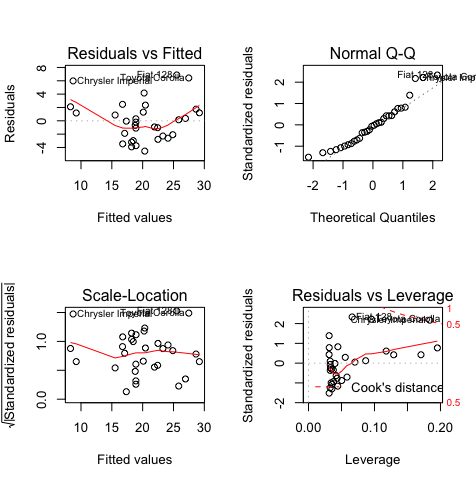
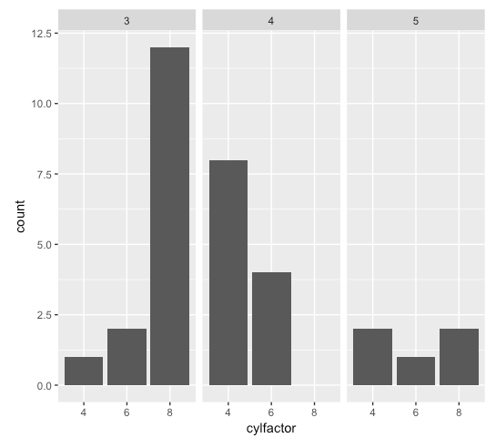

Lab 2. Data Visualization and Graphics
---------------------------------------------------


Data visualizations are very important in data science. They are used as
a part of **Exploratory Data Analysis (EDA)**, to familiarize
yourself with data, to examine the distributions of variables, to
identify outliers, and to help guide data cleaning and analysis. They
are also used to communicate results to a
variety of audiences, from other data scientists to customers.


In this lab, you\'ll learn about base plots, ggplot2, and will be
briefly introduced to more advanced plotting with the applications Shiny
and Plotly.

By the end of this lab, you will be able to:


-   Use Base R for plotting, and identify when to do so
-   Create a variety of different data visualizations using the ggplot2
    package
-   Explain different tools for interactive plotting in R


#### Lab Environment

All packages have been installed. There is no requirement for any setup.

All datasets and examples are present in `~/Desktop/R-Programming/lesson2/` folder. 


#### The plot() Function


**Note:**

In RStudio, sometimes the plot may be skewed or squished, as it is
constrained by the size of your plot window (usually the bottom-right
window, under the **`Plots`** tab.) You can, at any time, click the
**`Zoom`** button and your plot will pop out, usually larger, and give
you a better look:


We can plot just one variable of
`mtcars`, for example `mpg` or the miles per gallon
of the cars. This generates a very basic plot of `mpg` on the
y-axis, with `index` on the x-axis, literally corresponding to
the row index of each observation, as follows:


This plot isn\'t very informative, but it is powerful in terms of seeing
how well R can plot even when it is not installed on a particular
machine. Let\'s add in a second variable and plot `mpg` versus
`wt`:

``` 
plot(mtcars$wt, mtcars$mpg)
```


If we plot `mpg` versus `wt` ([*y*] vs.
[*x*]), we can see a clear negative linear trend, that is,
when the weight increases, the miles per gallon decreases. This isn\'t
terribly unexpected---heavier cars will require more gas to operate and will therefore get less miles to the
gallon.

You should also notice that the default axis labels are the variables
exactly as input into `plot()` (so, `mtcars$wt` and
`mtcars$mpg` include the dataset name and dollar sign to
access each variable). There is no title by default, and the default
shape is an open circle.

These last two plots were an example of what happens if you input
variables from a dataset into `plot()`. The `plot()`
function is very versatile, however, and you can input a number of
different things and still create base plots. Let\'s discuss a few of
the options in the next few subtopics.


#### Factor Variables


We input a few variables from `mtcars` into
`plot()`, but they were continuous. What happens if, instead,
we input a factor variable?

For example, the `cyl` variable in `mtcars` gives
the number of cylinders each car has. If we input it as a factor
variable into `plot`, we get a bar chart (histogram) by
default, where each bar gives a count of how many cars have each number
of cylinders:

``` 
plot(as.factor(mtcars$cyl))
```


Let\'s now create plots using factor
variables and learn to differentiate between plots created with factor
variables and those created without. Follow the steps given below:


1.  Load the `mtcars` dataset using the
    `data("mtcars")` method.
2.  Plot the gear variable of `mtcars` without changing it to
    a factor variable using `plot(mtcars$gear)`. What kind of
    plot do you get?
3.  Now, plot the gear variable of `mtcars` as a factor
    variable, as follows:


``` 
plot(as.factor(mtcars$gear)) 
```


What kind of plot is generated?

**Output**: The following scatterplot is the output we get
when the `gear` variable is plotted without changing it to the
factor variable:


The following histogram/bar chart is the output we get when the
`gear` variable is plotted after changing it to the factor
variable:


#### Model Objects


As we observed in the factor variable
example, the function defaults to certain types of plots depending on
the kind of data you put into it. If you were to input a linear model
object, `plot()` automatically returns four helpful model
diagnostic plots, including the Residuals versus Fitted and Normal Q-Q
plots, which help you determine whether your model fits well. The
following code demonstrates this:

``` 
mtcars_lm &lt;- lm(mpg ~ wt, data = mtcars)
plot(mtcars_lm)
```


The process of generating all four of these plots is somewhat tedious,
however, so instead, let\'s look at plotting more than one plot at a
time, combined with model object plotting.


##### Plotting More Than One Plot at a Time


One neat feature in R is that you can plot
more than one plot at a time on the same viewing window. Inside of
`par()`, if we pass `mfrow = c(rows, cols)`, where
`rows` is the number of rows of plots you\'d like and
`cols` is the number of columns of plots you\'d like, you can
plot a number of plots on the same screen. If we return to the
`mtcars_lm()` example we just covered, we can plot all four
model diagnostic plots in the same window by first running the following
line of code:

``` 
par(mfrow = c(2,2))
```


Next, you need to execute the following code:

``` 
plot(mtcars_lm)
```





This resets your Global Options in RStudio. So now, every time you try
and plot, it will make plots in a [*2 × 2*] grid. You\'ll
need to reset back to [*1 *]× [*1*] when you\'re
ready, using either `dev.off()` or simply
`par(mfrow = c(1,1))`.


##### Creating and Plotting a Linear Model Object


Let\'s use the function to create a
linear model object, and then
use `par()`, `mfrow()`, and `plot()` to
examine the model diagnostics. Follow the steps given below:


1.  Build your own version of `mtcars_lm`, which looks at how
    the displacement and weight variables affect `mpg` using
    the following code:


``` 
mtcars_lm &lt;- lm(mpg ~ disp + wt, data = mtcars)
```


2.  Run the following code to enable plotting a [*[*2
    × *]*][*2*] grid of plots so that
    looking at model diagnostic plots is easier with the following
    method:


``` 
par(mfrow = c(2, 2))
```


3.  Plot the `mtcars_lm` variable to see the model diagnostic
    plots using `plot(mtcars_lm)`.


**Note:**

Be sure to turn the [*[*2 *]*]× [*2*]
grid off. This will make the plot disappear, so be sure you\'re done
looking at it before you run this line.


4.  Turn the [*[*2 × *]*][*2*] grid off
    using `dev.off()`.


**Output**: The following is the output we get when we execute the
`plot()` function as mentioned in [*Step 3*].


#### Titles and Axis Labels


Let\'s return to our `mtcars` scatterplot, add a title and
subtitle, and also change the axis labels with the following code:

``` 
plot(mtcars$wt, mtcars$mpg,
     main = "MPG vs. Weight",
     sub = "mtcars dataset",
     xlab = "Weight",
     ylab = "MPG")
```


This adds our title and overrides the default behavior of printing axis
labels, which are exactly what was input for [*x*] and
[*y*]. The plot now has some context in the form of these
titles and labels, and is far more understandable, as shown in the
following screenshot:


Let\'s now add titles and axis labels to
base plots and utilize the `main`,
`sub`, `xlab`, and `ylab` options to
change the titles and axis labels of base plots. Follow the steps given
below:


1.  Load the `iris` dataset using `data("iris")`.
2.  Plot petal length and width from the `iris` dataset to see
    what the plot looks like, and take note of the default axis labels
    as follows:


``` 
plot(iris$Petal.Length, iris$Petal.Width)
```


3.  Now, add a title, subtitle, and custom axis labels to the same plot
    using the following code:


``` 
plot(iris$Petal.Length, iris$Petal.Width,
     main = "Petal Width vs. Length",
     sub = "iris dataset",
     xlab = "Petal Length",
     ylab = "Petal Width")
```


**Output**: The following is the output we get when we
execute the code line mentioned in *Step 2*:


The following is the output we get when we
execute the code mentioned in [*Step
3*]:


If we decide we\'d like to plot in a different color, say red, it\'s as
simple as passing `col = "red"` into `plot()`. R
supports the names of many different colors along with hexadecimal color
codes. The code to change the previous plot to red would be as follows:

``` 
plot(mtcars$wt, mtcars$mpg,
     main = "mpg vs. wt, mtcars data",
     xlab = "weight",
     ylab = "mpg",
     col = "red")
```


##### Changing the Color of Base Plots


Let\'s see how you can use the `col` option provided by the
`plot()` function to change a plot into a few different colors. Follow the steps given below:


1.  Use the `col` option to turn the plot from the last
    exercise blue as follows:


``` 
plot(iris$Petal.Length, iris$Petal.Width,
     main = "Petal Width vs. Length",
     sub = "iris dataset",
     xlab = "Petal Length",
     ylab = "Petal Width",
     col = "blue")
```


2.  Use the `col` option to turn the plot from the last
    exercise yellow using the hexadecimal color code `111111`:


``` 
plot(iris$Petal.Length, iris$Petal.Width,
     main = "Petal Width vs. Length",
     sub = "iris dataset",
     xlab = "Petal Length",
     ylab = "Petal Width",
     col = "111111")
```


**Output**:


1.  Check your **`Plot`** window after executing the code in [*Step
    1*] to be sure that the plot is now blue.
2.  Check your **`Plot`** window after executing the code in [*Step
    2*] to be sure that the plot is now yellow.


It is important to know and understand `plot()`, as base plots
are adequate and useful. However, the `ggplot2` package
has really taken over the R graphics
landscape, and as such we won\'t spend much more time on base plots.
Let\'s do a quick activity just to be sure we have the hang of them.


### Activity: Recreating Plots with Base Plot Methods


**Scenario**

You have been asked to create some base plots
that provide information on the `mtcars` and `iris`
datasets for a junior colleague.

**Prerequisites**

Make sure you have R and RStudio installed on your machine.

**Aim**

To use `plot()` by recreating different plots with different
base plot methods.

**Steps for completion**


1.  Load the datasets library using `library(datasets)`.
2.  Load the `iris` and `mpg` datasets. You will
    need to make individual calls, using `data("mtcars")`, for
    example. You will then see the dataset in your environment as a
    promise. It will appear as a dataset in your list of datasets in the
    upper-right window when you first attempt to use it.


3.  Recreate the following base plots using
    `iris` data:
    
    a.  A scatterplot to plot petal width without axis labels:
    


1.  
    b.  A scatterplot to plot petal length and width with axis labels:
    


1.  
    c.  Scatterplots in [*[*1
        × *]*][*2*] grids to plot petal
        length and width with axis labels:
    


4.  Recreate the following histogram using
    `mtcars` data to plot the number of cylinders in the color
    blue:


ggplot2
-------------------------


ggplot2 is an incredibly popular graphics
package in R. It can be installed on its own or comes as part of the
`Tidyverse` set of packages.


When you\'re using ggplot2, both as you\'re learning how to use it and
even when you\'re more seasoned, the official RStudio ggplot2 cheat
sheet will be a resource you may want to keep
close for your reference. It will not only remind you of the basics (and
more advanced implementations) of how to use ggplot2, it gives
suggestions for which plots to use when you have certain types of
variables (for example, if you have one continuous variable, you can
build a histogram using `geom_hist()`).


**Note:**

The ggplot2 cheat sheet can be found at the following URL:
<https://www.rstudio.com/wp-content/uploads/2015/03/ggplot2-cheatsheet.pdf>. 


RStudio has also made many different cheat sheets available for common R
packages. They can be found on their official website at the following
URL:https://www.rstudio.com/wp-content/uploads/2015/03/ggplot2-cheatsheet.pdf

First and foremost, you\'ll need to install ggplot2 using
`install.packages("ggplot2")` or through point-and-click
methods. Then, when you load ggplot2 in RStudio using
`library(ggplot2)`, it immediately suggests the ggplot2
**Stack Overflow** tag as a good place to go for any help you might need ggplotting.


**Note:**

The online documentation for ggplot at the `Tidyverse` website
is thorough and can be used to supplement the built-in documentation.
The URL is as follows: <http://ggplot2.tidyverse.org/index.html>. It
contains many examples and thorough explanations of every element of
ggplot2 and is maintained by the authors of the package.


### ggplot2 Basics


To begin with, here is the exact same data,
plotted both with `plot()` and `ggplot()`,
respectively:


This is the built-in `cars` dataset, which contains only two
variables, `speed` and `dist`. You can generate
these plots yourself, as follows:


-   Plot 1:


``` 
plot(cars)
```


-   Plot 2:


``` 
library(ggplot2)
ggplot(cars, aes(speed, dist)) + geom_point()
```


Voilà! A plot and a ggplot. Which is more
aesthetically pleasing to you? Which would you rather publish on a
report or your blog? The answer is [*probably*] the ggplot,
if you\'re like most data scientists out there.

Using ggplot2 requires you to begin to think of each element of a plot
as a layer.

First, you have a white screen with only axes defined, two lines
symbolizing the [*x*] and [*y*] axes. Using the
`ggplot()` function, you layer on a dataset that contains what
you\'ll plot and the aesthetics of the plot, defined in the
`aes()` function, which corresponds to the things to plot and
how to plot them. Then, you layer on a geom, using a
`geom_*()` function, which tells ggplot2 what kind of plot
you\'re trying to make. You can layer on additional aesthetics, such as
plot titles, axis labels, colors, different point types, and more.

``` 
ggplot(data = &lt;DATA&gt;) + &lt;GEOM_FUNCTION&gt;(mapping = aes(&lt;MAPPINGS&gt;))
```


In the call, we see the three things required by all ggplots:


1.  Dataset (`DATA`)
2.  Geom (`GEOM_FUNCTION`)
3.  Mappings (`MAPPINGS`)


Your dataset, entered in `DATA`, will be the dataset you\'re
looking to plot variables from. Geoms take the form of
`geom_*()`, where the `*` will be the name of the
type of plot you\'re looking to create, for example
`geom_point()`for a scatterplot, `geom_ boxplot()`
for a boxplot, and `geom_histogram()` for a histogram (perhaps
you\'re detecting a theme here in how the `geom_*()` functions
are named!)

Mappings are the variables you want to graph plus other aesthetics
(`aes()` is short for aesthetics)

``` 
ggplot(data = &lt;DATA&gt;, aes(&lt;GLOBAL MAPPINGS&gt;)) + &lt;GEOM_FUNCTION&gt;(mapping = aes(&lt;LOCAL MAPPINGS&gt;))
```


There are a few things you should know about creating ggplots that will
help you along the way. Firstly, you can save a ggplot call and use it
for multiple graphs, for example:

``` 
#save the ggplot data and mappings as 'mtcars_ggplot':
mtcars_ggplot &lt;- ggplot(mtcars, aes(wt, mpg))
#create 2 additional plots:
mtcars_ggplot + geom_point()
mtcars_ggplot + geom_point(aes(col = factor(cyl)))
```


The first line of code saves a ggplot object called
`mtcars_ggplot`, which says that you want to use the
`mtcars` dataset and the weight (`wt`) and miles per
gallon (`mpg`) variables for plotting. This object will be
saved in your R environment as a list, and you can view it in the
environment by hitting the magnifying glass icon next to its name:


The plus signs you\'ll need to add layers to a
`ggplot()` object must [*always*] come at the end
of a line. The following code will run successfully to create the plot
we saw at the beginning of this subtopic:

``` 
ggplot(cars, aes(speed, dist)) + geom_point()
```


The following code will not run, because the plus sign has been moved
down to the second line, in front of `geom_point()`:

``` 
ggplot(cars, aes(speed, dist)) + geom_point()
```


If you attempt to run code with the plus sign at the beginning of a
line, preceding `geom_point()`, as in the previous example, a
blank plot, as shown in the preceding screenshot, will generate in your
**`Plots`** window in RStudio and you will get the following error in
your console:

``` 
Error in +geom_point() : invalid argument to unary operator
```


#### Histogram


When you have one continuous variable, it\'s a good idea to use a
histogram to get an idea of its distribution. The height of the bar of
the histogram corresponds to the number of
observations that have that value. We can create a histogram of the
`mpg` variable in mtcars using the following code:

``` 
ggplot(mtcars, aes(mpg)) + geom_histogram()
```


This code will throw a warning:

``` 
'stat_bin()' using 'bins = 30'. Pick better value with 'binwidth'.
```


`binwidth = 10` gives us almost no detail---we can see three
groups of observations of the data:


`binwidth = 1` isn\'t bad, but the graph shows some gaps.
Let\'s see if we can close them:


Using a binwidth of 3 shows decent amount of
detail, as shown in the following graph:


##### Creating Histograms using ggplot2


In this section, we will create a histogram
with ggplot2 and experiment with different binwidths to find the best
representation of the data. Follow the steps below:


1.  Install the `ggplot2` library and then load it:


``` 
install.packages("ggplot2")
library(ggplot2)
```


2.  Load the `msleep` dataset, a built-in dataset that comes
    installed with ggplot2, using `data("msleep")`.


3.  Create a histogram of the `sleep_total` variable from
    `msleep`. Do you get the binwidth error?


``` 
ggplot(msleep, aes(sleep_total)) + geom_histogram()
```


4.  Try the same histogram, but with `binwidth = 10`. Does the
    histogram improve?


``` 
ggplot(msleep, aes(sleep_total)) + geom_histogram(binwidth = 10)
```


5.  Try the histogram one more time, now with `binwidth = 1`:


``` 
ggplot(msleep, aes(sleep_total)) + geom_histogram(binwidth = 1)
```


**Output**: We get a binwidth error along with the following graph when we try to create a histogram
of the `sleep_total` variable from the `msleep`
dataset using the code mentioned in [*Step 3*]:


The following is the histogram with
`binwidth = 10`:


The following is the histogram with
`binwidth = 1`:


#### Bar Chart


For one categorical or factor variable, you
can create a bar chart. We can create a bar chart of the `cyl`
variable of `mtcars` using the following code:

``` 
#using geom_bar()
ggplot(mtcars, aes(cyl)) + geom_bar()
```


One fun fact is that we can actually create bar charts with the
`geom_histogram()` call as well, by including
`stat = "count"`, as follows:

``` 
#using geom_histogram() and stat
ggplot(mtcars, aes(cyl)) + geom_histogram(stat = "count")
```


You can ignore the warning it will throw;
this creates the exact same bar chart:


##### Creating a Bar Chart with ggplot2 using Two Different Methods


Let\'s create a bar chart with ggplot2 using
both `geom_bar()` and `geom_hist()`.


1.  Create a bar chart of the `vore` variable from
    `msleep` using `geom_bar()`, as follows:


``` 
ggplot(msleep, aes(vore)) + geom_bar()
```


2.  Create the same bar chart of the `vore` variable from
    `msleep` using
    `geom_ histogram(stat = "count")`, as follows:


``` 
ggplot(msleep, aes(vore)) + geom_histogram(stat = "count")
```


**Output**: The following is the output we get after executing the code mentioned in [*Step
1*]:


The following is the output we get after
executing the code mentioned in *Step 2*:


#### Scatterplot


We can create a scatterplot with the `wt` and `mpg` variables from `mtcars` using the following code:

``` 
ggplot(mtcars, aes(wt, mpg)) + geom_point()
```


Though we won\'t really be able to see much of an effect with this
dataset, you can create a scatterplot with a bit of jitter introduced
using the following code:

``` 
ggplot(mtcars, aes(wt, mpg)) + geom_jitter(width = 0.1)
```


You can control exactly how much jitter by inputting `width =`
some number into `geom_jitter()`:


##### Creating a Scatterplot of Two Continuous Variables


Let\'s now create scatterplots using
`geom_point()` and `geom_()`.


1.  Create a scatterplot of the `bodywt` and
    `sleep_total` variables from `msleep`:


``` 
ggplot(msleep, aes(bodywt, sleep_total)) + geom_point()
```


2.  This scatterplot is a great candidate for using
    `geom_jitter()`, as many of the `sleep_total`
    observations cluster around the zero bodyweight. We\'ll use a fairly
    large width for jitter to really separate these points, because the
    scale of `bodywt` is in the thousands:


``` 
ggplot(msleep, aes(bodywt, sleep_total)) + geom_jitter(width = 50)
```


**Output**: The following is the output we get when we execute the code mentioned in [*Step
1*]:


The following is the output we get when we
execute the code mentioned in *Step 2*:


#### Boxplot


Boxplots are most appropriate when you want
to check the distribution of a continuous [*y*] variable with
some categorical (factor) [*x*] variable. We cannot create a
boxplot of the `mpg` variable with the `cyl`
variable in `mtcars` using the following code:

``` 
ggplot(mtcars, aes(cyl, mpg)) + geom_boxplot()
```


We will get a warning as follows:

``` 
Warning message: Continuous x aesthetic -- did you forget aes(group=...)?
```


The `cyl` variable is not explicitly declared as a factor
variable in the `mtcars` dataset, so ggplot is confused about
what the [*x*] variable is supposed to be. This is similar to
when we created base plots with factor
variables, though as we saw, `plot()` will still plot a
variable not declared as a factor, but it will create a scatterplot
instead of the desired histogram. The following code, which transforms
`cyl` into a factor variable using `as.factor()`,
will fix it and plot the boxplot correctly:

``` 
ggplot(mtcars, aes(as.factor(cyl), mpg)) + geom_boxplot()
```


Thus, we get the following graph as an output:


Of course, now the axis label reads `as.factor(cyl)`, because
the default axis label is whatever is input as [*x*]. We\'ll
learn how to fix that in the next subtopic!


##### Creating Boxplots using ggplot2


Let us create a boxplot using
`geom_boxplot()`.


1.  Create a boxplot of `sleep_total` with `vore`,
    both variables from the `msleep` dataset
    using the following code:


**Note:**

Notice that **`omni`** seems to have four outliers, represented by the
black dots outside of the boxes, which represent the **Interquartile
Range** (**IQR**) of the `sleep_total` of
each variable. 


``` 
ggplot(msleep, aes(vore, sleep_total)) + geom_boxplot()
```


**Output**: We get the following boxplot as the output after
executing the preceding code:


While these four types of plots are far from everything available in
ggplot2, everything we\'ve gone over so far
in this subtopic should be enough to get started creating basic ggplots.
To start, we should get comfortable with building the basics, and then
we\'ll extend them using other calls to `aes()`, plus titles
and custom axis labels.


### Activity: Recreating Plots Using ggplot2


**Scenario**

You have been asked to create some ggplots
that provide information on the `mtcars` and `iris`
datasets for a presentation in your office.

**Prerequisites**

You should have RStudio and R installed on your machine. The ggplot2
package should also be installed.

**Aim**

To construct basic ggplots by recreating some of those shown in the
preceding exercises.

**Steps for Completion**


1.  Load `ggplot2` using `library(ggplot2)`.


2.  Try to recreate all of the following
    ggplots using the `iris` dataset:
    
    a.  A histogram to plot petal width:
    


 


1.  
    b.  A scatterplot to plot petal length and width:
    


1.  
    c.  Boxplot to plot petal width and the
        `Species` factor variable:
    


4.  Try to recreate the following bar chart
    ggplot using the `gear` variable of the `mtcars`
    dataset:


### Digging into aes()


While we have created some basic ggplots, we
haven\'t really dug much into the aesthetics of plots. There are
definitely both some global and plot-specific aesthetics that are very
important to know when you\'re building plots.

One key distinction to master is that when you call something inside of
`aes()`, the aesthetic is mapped to the value of the variable
in the data. Outside of an `aes()` call, the aesthetic is set
to a specific value. This is perhaps best understood with an example.

The following code is a bar chart of how many
cars have each number of cylinders, where `fill` is the number
of gears the car has, all from `mtcars`:

``` 
ggplot(mtcars, aes(cyl, fill = as.factor(gear))) + geom_bar()
```


A legend appears to let us know which color corresponds to which number
of gears, as shown in the following graph:


The `fill` is inside of `aes()` and the variable is
entered as a factor, both of which are required for this to work.

If, instead, you were looking to make all of the bars light blue, seeing
the preceding code, you might be tempted to run the following code:

``` 
ggplot(mtcars, aes(cyl, fill = "lightblue")) + geom_bar()
```


Or even the following code:

``` 
ggplot(mtcars, aes(cyl, fill = lightblue)) + geom_bar()
```


However, this code is looking for a thing
called `lightblue` in the dataset, because you entered it
inside of `aes()`. To actually fill the bars light blue, you
should use:

``` 
ggplot(mtcars, aes(cyl)) + geom_bar(fill = "lightblue")
```


This produces the following graph of the bar chart of the count of cars
of each cylinder type, but the bars have been colored light blue:


There are some very helpful global and local options that you\'ll
probably need when you\'re using ggplot2 to create different plots. Let\'s go through a few of them.


#### Bar Chart


To make these charts better, we\'re going to
convert the `cyl` and `gear` variables in
`mtcars` to factor variables using the following code:

``` 
mtcars$cylfactor &lt;- as.factor(mtcars$cyl)
mtcars$gearfactor &lt;- as.factor(mtcars$gear)
```


Use of the factor variables will help the data display properly.

We previously saw how to both automatically change the color of a bar
chart (when we made them light blue) and also how to fill a bar chart
with another variable. We did this using the following code:

``` 
ggplot(mtcars, aes(cyl, fill = gearfactor)) + geom_bar()
```


The `fill` indicates the count of each car with a particular
type of cylinder and gear. There are a few other ways to display the
fill that we can use.

If we want the bars to be next to each other instead, we can add
`position = "dodge"` inside `geom_bar()`, with the
following code:

``` 
ggplot(mtcars, aes(cyl, fill = gearfactor)) + geom_bar(position = "dodge")
```


The output will be as shown in the following screenshot:


Now, the bars are all next to each other, and
it\'s actually somewhat easier to see that there are no eight-cylinder
cars with four gears. ggplot2 also automatically adds a legend to
ggplots when you\'re plotting with colors or shapes.

If we want the bars to reflect percentages instead of representing the
count of cars with a certain number of gears and cylinders, we can add
`position = "fill"` inside `geom_bar()`:

``` 
ggplot(mtcars, aes(cyl, fill = gearfactor)) + geom_bar(position = "fill")
```


The output we get is as follows:


While the [*x*]-axis still says
**`count`** (we\'ll be rid of this soon!), it has rescaled from 0 -
1.00, because it represents the percentages instead of counts.


##### Using Different Bar Chart Aesthetic Options


Let\'s now create bar charts using the
`dodge` and `fill` bar chart position aesthetic
options.


1.  If not loaded from the last topic, load the `msleep`
    dataset using `data("msleep")`.


2.  Create a bar chart using the `dodge` position aesthetic of
    `vore`, filled with the `conservation` variable.
    (These variables are already declared as factor variables when you
    load `msleep`.) The code for this is as follows:


``` 
ggplot(msleep, aes(vore, fill = conservation)) + geom_bar(position = "dodge")
```


3.  Create a bar chart with the same variables, this time using the
    `fill` position aesthetic:


``` 
ggplot(msleep, aes(vore, fill = conservation)) + geom_bar(position = "fill")
```


**Output**: The following is the output we get when we execute the code mentioned in [*Step
1*]:


The following is the output we get when we
execute the code mentioned in *Step 2*:


#### Facet Wrapping and Gridding


**Facet wrapping** and gridding can be applied to any ggplot, not just bar charts. Facet wrapping will
split the base ggplot (which, here, is the
count of cars with each number of cylinders)
by a second variable, which, here, will be the number of gears,
generating three plots. The code for this is as follows:

``` 
ggplot(mtcars, aes(cylfactor)) + geom_bar() + facet_wrap(~gear)
```


We can see that each of the three numbers of gears (**`3`**, **`4`**,
**`5`**) have a bar chart for the count of the number of cars with each
of the three types of cylinders (here, `cylfactor`, with
values **`4`**, **`6`**, **`8`**). Facet wrapping can be applied to any
of the ggplots, though it may sometimes look strange, which can be
mitigated with facet gridding.

**Facet gridding** is closely related to facet wrapping but allows for gridding by
(`row ~ column`). The following code will generate the same as
the preceding facet wrapping code, as gear is in the column place:

``` 
ggplot(mtcars, aes(cylfactor)) + geom_bar() + facet_wrap(~gear)
```





However, if you move gear to the row place,
it will grid the plots by row instead of
column, as shown in the following code:

``` 
ggplot(mtcars, aes(cylfactor)) + geom_bar() + facet_grid(gear~)
```


Thus, the output we get will be as follows:


**Note:**

You must remember to put the period in the columns place, which stands
for [*all columns*], or the code will not run.


##### Utilizing Facet Wrapping and Gridding to Visualize Data Effectively


Let\'s create bar charts using the
`facet_wrap()` and `facet_grid()` functions. Follow
the steps below:


1.  Create a bar chart of `conservation`, facet wrapped by
    `vore`, both variables from the `msleep`
    dataset, as shown in the following code:


``` 
ggplot(msleep, aes(conservation)) + geom_bar() + facet_wrap(~vore)
```


2.  Create the same bar chart, but use `facet_grid()` to grid
    the charts by row instead of column, as shown in the following code:


``` 
ggplot(msleep, aes(conservation)) + geom_bar() + facet_grid(vore~)
```


**Output**: The following is the output we get when we execute the code in [*Step 1*]:


The following is the output we get when
we execute the code in *Step 2*:


#### Boxplot + coord\_flip()


One handy feature to know about is an
additional aesthetic layer, `coord_flip()`. Given that R
functions are named in an informative way, it probably does more or less
exactly what you\'d think.

Let\'s return to our boxplot example from `mtcars`, which
shows the distribution of `mpg` by the number of cylinders. We
modify the code and add `coord_flip()` as follows:

``` 
ggplot(mtcars, aes(cylfactor, mpg)) + geom_boxplot() + coord_flip()
```


The output we get will be as shown in the
following screenshot:


We see that `cylfactor` is now on the [*y*]-axis
and `mpg` is on the [*x*]-axis, and the boxplots
can flip. `coord_flip()` can be implemented on other ggplots
as well, but boxplots are a good way to easily see its effect.


#### Scatterplot


Scatterplot requires a bit more care than the
other graphs we\'ve covered to be truly meaningful and visually
appealing. We\'ll return to our `mtcars` example of plotting
`mpg` versus `wt`. If you recall the code used to
build boxplots, you might be tempted to color the scatterplots using
`fill = cylfactor` and code that looks like this:

``` 
ggplot(mtcars, aes(wt, mpg, fill = cylfactor)) + geom_point()
```


When we run this, we see that a legend has appeared that has the
appropriate values of `cylfactor`, but the dots are all still
black, so we\'ve gained no new information. How do you think we fix
this?

If you thought to yourself [*We need to use `col = cylfactor`
in that `aes()` call*], then you\'re absolutely
right. The code should be:

``` 
ggplot(mtcars, aes(wt, mpg, col = cylfactor)) + geom_point()
```


The code will also run if you spell out `col` as
`color`. We can change the shape of the points inside a
scatterplot with the shape aesthetic. `shape = 17` makes all
the points into little triangles. The code is as follows:

``` 
ggplot(mtcars, aes(wt, mpg)) + geom_point(shape = 17)
```


The output we get is as follows:


However, these are very tiny. Let\'s make them bigger with the size
options, which we\'ll also specify inside of `geom_point()`
itself. Here is the code for it:

``` 
ggplot(mtcars, aes(wt, mpg)) + geom_point(shape = 17, size = 3)
```


Much better! If we had specified color as well, these settings would
also apply.

With the bigger size, there\'s a small amount
of overlap with some of the triangles. We can control the transparency
using `alpha` = some number between 0 (transparent) and 1
(opaque). Let\'s start with `alpha = 0.6` and then adjust as
needed. Here is the code for that:

``` 
ggplot(mtcars, aes(wt, mpg)) + geom_point(shape = 17, size = 3, alpha = 0.6)
```


##### Utilizing Different Aesthetics for Scatterplots, Including Shapes, Colors, and Transparencies


Let us create scatterplots and change the
shape and size of points, the colors, and the transparency of points.
Follow the steps given below:


1.  To make these scatterplots more visually appealing, load
    `dplyr` and remove the two observations with a
    `bodywt` greater than `2000`, creating the
    `msleep2` dataset, as follows:


``` 
library(dplyr) msleep2 &lt;- msleep %&gt;% filter(bodywt &lt; 2000)
```


2.  Now, create a scatterplot of `bodywt` versus
    `brainwt`, using triangles for the points. You will see an
    error in your console window saying that it removed rows with
    missing values. Don\'t worry about this for now; missing data isn\'t
    the focus of this exercise.


``` 
ggplot(msleep2, aes(brainwt, bodywt)) + geom_point(shape = 17)
```


3.  Create the same scatterplot but make the triangles much bigger.


``` 
ggplot(msleep2, aes(brainwt, bodywt)) + geom_point(shape = 17, size = 6)
```


**Output**: The following is the output we get after
executing the code mentioned in *Step 2*:


The following is the output we get after executing the code mentioned in
[*Step 3*]:


We\'ve covered some global and local
aesthetics that are very useful when building ggplots. Let\'s do a few
examples to help master them.


### Activity: Utilizing ggplot2 Aesthetics


**Scenario**

You have been asked to create some ggplots
that provide information on the `mtcars` and `iris`
datasets for a presentation for your colleague, as shown in the
following screenshot:


**Aim**

To get the students comfortable with using more aesthetic options in
their ggplots by having them recreate a few, as shown.

**Prerequisites**

Make sure you have R and RStudio installed on your machine. The ggplot2
package should also be installed.

**Steps for Completion**


1.  Load `ggplot2` using `library(ggplot2)`.
2.  Try to recreate the ggplots shown as
    follows.
3.  The plots use the following datasets:
    
    -   Plots 1 and 2: `mpg`
    


 


1.  
    -   Plots 3 and 4:`diamonds`
    


### Extending the Plots with Titles, Axis Labels, and Themes


Thus far, we\'ve learned much of how ggplot2
works by creating a few often-used plots. We
have not addressed adding titles, customizing axis labels, or themes.
Let\'s look at the basics of these three
things.

Titles and axis labels can be added in two different ways in ggplot2.

If you\'re interested in changing everything in one go, you can use the
`labs()` function. `labs()` takes as an argument
anything you\'d like to change the label of, such as title, subtitle,
[*x*], [*y*], caption, or even the label of the
legend. It is often used as follows:

``` 
mtcars_ggplot + geom_point() + 
labs(title = "mpg vs. wt", 
     ubtitle = "mtcars dataset",
     x = "weight",
     caption = "decreasing linear trend")
```


This adds a title and a subtitle, changes the [*x*]-axis
label, and adds a caption.

These changes can all be made individually with the corresponding
individual functions, such as `ggtitle()`, `xlab()`,
and `ylab()`. They can all be added individually as
layers to your plot to adjust the corresponding aspects.

Themes make more sense when demonstrated.
We\'ll only cover a few of the built-in ggplot2 themes, but know that
building your own custom themes for ggplot2 is entirely possible.

Let\'s return to an example we\'ve used a few times in this lab and
see how a few different themes change the look. The `mtcars`
dataset with `mpg` versus `wt`, colored by cylinder,
is a great one. The default theme is `theme_gray()`, so we\'ll
skip that one.

The other themes available are as follows:


-   `theme_bw()` removes the gray background and makes it
    black and white. Very straightforward.
-   `theme_classic()` removes everything behind the points:
    there are no secondary axis marks or fill, only blank white space,
    as shown in the following screenshot:


-   `theme_dark()` makes everything behind the points a much
    darker gray. You can see that it also changes the legend to match,
    as shown in the following screenshot:


-   `theme_minimal()` leaves the axis marks very light gray,
    but includes no fill. The output is as follows:


These are just a few theme examples. There are more listed in the
documentation that you could experiment with, and you can create your
own custom themes once you have more experience with ggplot.


**Note:**

When you\'re looking to save your ggplots, you have two options. You can
use the **`export`** button above your plot on the **`Plots`** tab in
the viewer, or you can use the `ggsave()` function.


`ggsave("my_mtcars_plot.png")` will save your plot as a PNG
with the filename `my_ mtcars_plot` in your working directory.
If you want to specify another directory, you can do that as well,
using `ggsave("images/my_mtcars_plot.png")`, which saves the
plot instead in a folder called `images`.

Let us now add titles and axis labels to ggplots by extending the
aesthetic options. Follow the steps given below: 


1.  Load `ggplot2` using `library(ggplot2)`.
2.  Try to recreate the ggplots shown as follows. :
    
    -   Execute the following code:
    


``` 
library(ggplot2)
ggplot(cars, aes(speed, dist)) + geom_point() +
labs(title = "dist vs. speed",
     subtitle = "cars dataset",
     y = "distance")
```


The output of the preceding code will be as follows:


1.  
    -   Execute the following code:
    


``` 
ggplot(cars, aes(speed, dist)) + geom_point() +
ggtitle("dist vs. speed",
        subtitle = "cars dataset") +
        ylab("distance")
```


The output of the preceding code will be as follows:


1.  
    -   Execute the following code:
    


``` 
ggplot(diamonds, aes(carat, price, col = cut)) + geom_point(alpha = 0.4) + theme_minimal()
```


The output of the preceding code will be as follows:


Summary
-------------------------


Graphing in R will be crucial in your data science work, and we have
covered most of the basics here. However, graphing is one of those
things where, most of the time, there are always going to be different
types of graphs you haven\'t heard of yet and options you haven\'t yet
selected, so it\'s important to know where to look for assistance and
how to keep learning.

Let\'s press forward on to the next topic, where we\'ll begin to look at
some data more closely, doing some cleaning and data management
necessary to get us one step closer to modeling and analysis.
