Lab 3. Data Management
-----------------------------------


In Lab 2, it was mentioned that
data visualization is a key part of EDA. The techniques for data
management we\'ll discuss in this lab constitute the other important
parts of EDA, which you should always do prior to modeling and analysis.
In this lab, we will address what a factor variable is and how to
use one, how to summarize your data numerically, how to combine, merge,
and split datasets, and how to split and combine strings.

By the end of this lab, you will be able to:


-   Create and reorder factor variables
-   Generate pivot tables
-   Aggregate data using the base and dplyr packages
-   Use various methods to split, apply, and combine data in R
-   Split character strings using the stringr package
-   Merge and join different datasets using base R and the dplyr methods


#### Lab Environment

All packages have been installed. There is no requirement for any setup.

All datasets and examples are present in `~/Desktop/R-Programming/lesson3/` folder. 


Factor Variables
----------------------------------

Recall our discussion of variable classes and types from Lab 1. A factor variable will always be of
class `factor`, but can be any type: `character`,
`numeric`, `integer`, or otherwise. For example, a
variable indicating month can have the months as type
`character` (`"January"`, `"February"`,
\...) or can be indicated with integers (`1`, `2`,
`3`, ...).


**Note:**

You can access the class of an object, variable, dataset, or just about
anything else in R using this
code: `class(dataset$variable_name)` You can find out the type
of the variable using this code:
`typeof(dataset$variable_name)`


Let\'s learn more about what factor variables are and how to use them.

Let\'s return to the `mtcars` and `iris` datasets,
both of which we\'ve used previously. (They\'re very common examples of
datasets that are used in R, if you haven\'t caught on to that yet!)
After loading, let\'s examine each dataset with the method
`str()`, as follows:

``` 
data("mtcars")
str(mtcars)
data("iris")
str(iris)
```


`mtcars` has no factor variables specified out of the box, but
the Species variable in the `iris` dataset is explicitly
declared to be a factor variable with three levels: `setosa`,
`versicolor`, and, if we could see it, `virginica`.
We can see all three by using the `levels()` function, as
shown in the following screenshot:


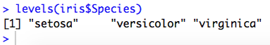


Recall that in Lab 2, we examined plotting
with factor variables: if you insert a factor into the generic
`plot()` function, you get a bar chart instead of a scatter plot, where the bar chart shows counts
of each observation at unique levels of the factor variable.

Since we\'ve discussed what a factor variable is, let\'s go through some
other questions you may have about factors.


**Why Should You Use a Factor Variable?**


For example, let\'s build a linear regression
model to examine the relationship between the number of cylinders
(`cyl`) and miles per gallon (`mpg`) in cars in the
`mtcars` dataset. We\'ll use `cyl` both as an
integer variable and as a factor variable.

We can use `cyl` as an integer variable as follows:

``` 
summary(lm(mpg ~ cyl, data = mtcars))
```


The output is as follows:


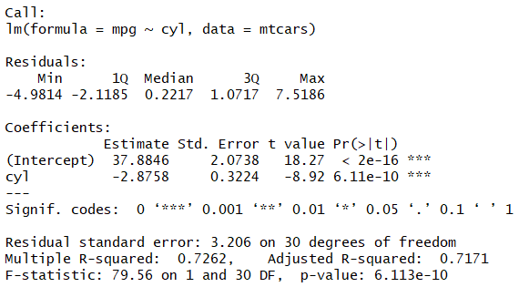


We can use `cyl` as a factor variable as follows:

``` 
summary(lm(mpg ~ as.factor(cyl), data = mtcars))
```


The output is as follows:


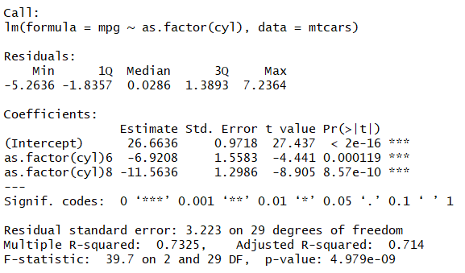


We can rerun the code to plot the `cyl` variable without
transforming it into a factor, as follows:

``` 
plot(mtcars$cyl)
```


We get the scatterplot as an output, as shown in the following
screenshot:


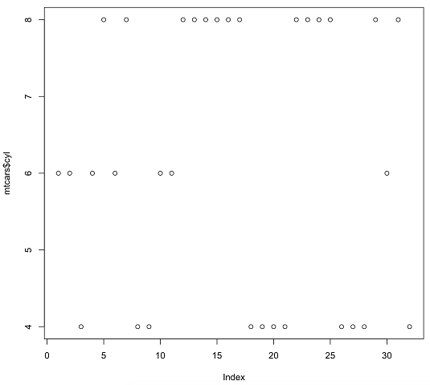


This doesn\'t really tell us anything about
the variable. Similarly, if we try to create a graph using
`ggplot2`, for example, by using a boxplot of `mpg`
by `cyl` without transforming it into a factor, we\'ll get a
warning:


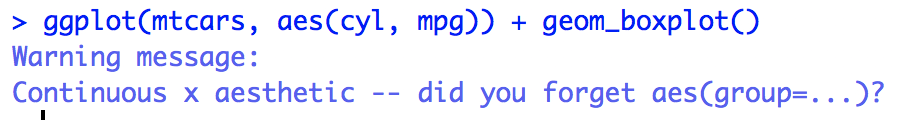


The plot will be only one boxplot, because there\'s no group variable.
Again, this is incorrect and uninformative. Thus, we should change
`cyl` into a factor variable using `as.factor()`, as
follows:

``` 
ggplot(mtcars, aes(as.factor(cyl), mpg)) + geom_boxplot()
```


Here is the boxplot we are looking for:


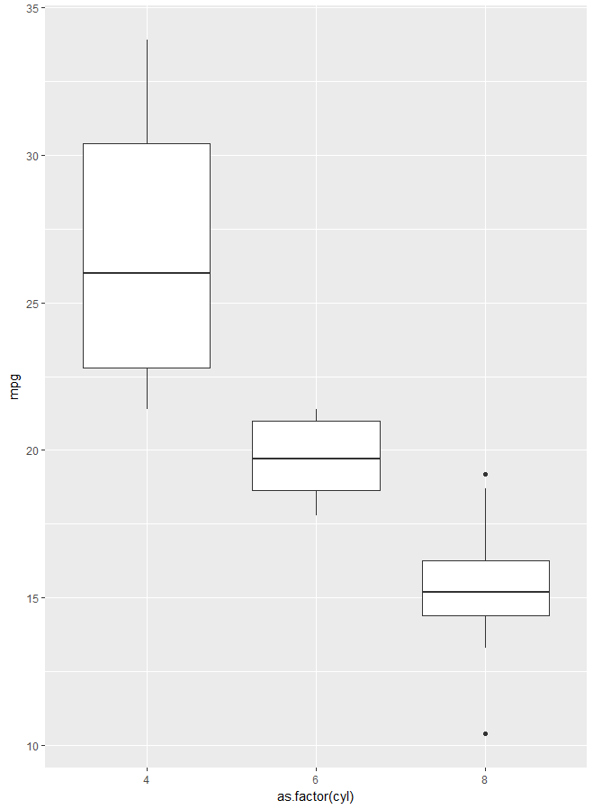


Now that we know when and why to use a factor
variable, let\'s learn how to create one.


**How Should You Create a Factor Variable?**

We\'ve seen many times in this lab and the preceding one that we can
create factor variables using the `as.factor()` method. The
input can be a variable from a dataset or a vector of values.

Typically, when you want to change a variable
in a dataset to a factor, you overwrite the variable or create a second
one. For example, to change the `cyl` variable in
`mtcars` to a factor, you could either overwrite it or create
another variable, as follows:


1.  Overwrite the `cyl` variable and create it as a factor
    using the following code:


``` 
mtcars$cyl <- as.factor(mtcars$cyl)
```


2.  Create a second variable, `cyl2`, which will be a factor
    version of the original `cyl` variable as follows:


``` 
mtcars$cyl2 <- as.factor(mtcars$cyl)
```


**Note:**

Whether you overwrite the original variable or create a second variable
is up to you and will depend on the project, storage constraints, and
your preferences. If you choose to overwrite the original variable, be
sure to have a copy of the original dataset backed up in case something
goes wrong!


Often, it will be the case that you\'d like to transform more than one
variable in your dataset into factor variables. To do this, you have a
few options. For example, the variables `cyl`, `am`,
and `gear` in the `mtcars` dataset are all
categorical and should be transformed to factors. A good way to do this
is by using the following code:

``` 
factors <- c("cyl", "am", "gear") 
mtcars[,factors] <- data.frame(apply(mtcars[,factors], 2, as.factor))
```


We can check to be sure this worked by using `str()` as
follows:

``` 
str(mtcars)
```


We see that the variables `cyl`, `am`, and
`gear` are now all factor variables, as shown in the following
screenshot:


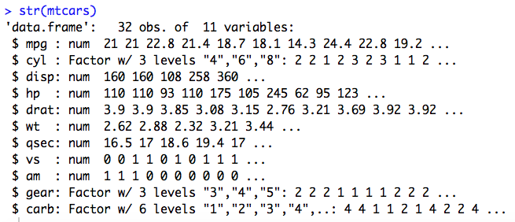


### Creating Factor Variables in a Dataset


Herein, we will create factor variables in a
dataset both one at a time and by using a method that converts multiple
variables at once. In order to do so, the following steps have to be
executed:


1.  Load the `datasets` library:


``` 
library(datasets)
```


2.  Load the `midwest` dataset and examine it with
    `str()`:


``` 
data(midwest) 
str(midwest)
```


3.  Convert the `state` variable to a factor by using
    `as.factor()`:


``` 
midwest$state <- as.factor(midwest$state)
```


4.  Load the `band_instruments` dataset and examine it with
    `str()`:


``` 
data(band_instruments)
str(band_instruments)
```


5.  Transform both variables in `band_instruments` to factor
    variables using `apply()`:


``` 
band_instruments <- data.frame(apply(band_instruments, 2, as.factor))
```


6.  Double-check that [*Step 5*] worked using
    `str()`:


``` 
str(band_instruments)
```


**Output**: The following is the output of the
code mentioned in *Step 2*:


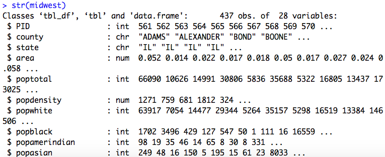


The following is the output of the code mentioned in *Step 4*:


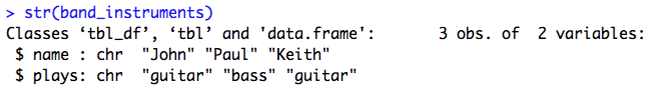


The following is the output of the code
mentioned in [*Step 5*]:


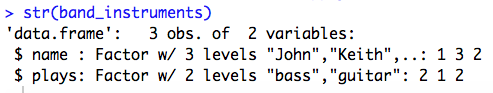


**How Do You Know if Something is Already a Factor?**

You can check if a variable or vector of
values is already a factor by using `is.factor()`. It will
return `TRUE` or `FALSE` accordingly. Alternatively,
you can check the class using `class()` or use
`str()` to view either the entire dataset\'s variable names
and types (if you input the dataset name) or just the one variable (if
you only input that):


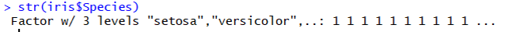


**What are the Levels of a Factor, and How Can You Change
Them?**

The levels of a factor are the particular
categories for that variable. They are a special attribute of factor
objects in R. You can view them with the `levels()` function,
as shown in the following example:

``` 
levels(iris$Species)
```


It returns the three species of irises indicated in the
`Species` variable column, as follows:

 


If we want to change the levels of the
factor, we can do so in two ways:


-   Using `ifelse()` statements

-   Using the `recode()` function


#### Using ifelse() Statements


The following code will change the
representation of the three species to numbers:

``` 
iris$Species2 <- ifelse(iris$Species == "setosa", 1,
ifelse(iris$Species == "versicolor", 2, 3))
```


We can verify if it has worked by running the `table()`
function as follows (more on this function in the next section!):

``` 
table(iris$Species)
```


Thus, we will get the following output:


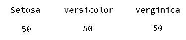


We can also execute the following code to verify whether the
representation has changed:

``` 
table(iris$Species2)
```


Here is the output that we will get:


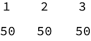


#### Using the recode() Function


The `recode()` function, available in the `dplyr`
package, can change the level of the factor by using more readable code, as follows:

``` 
library(dplyr)
iris$Species3 <- recode(iris$Species,
                        "setosa" = 1,
                        "versicolor" = 2,
                        "virginica" = 3)
```


These are both valid options, and which one you use is up to you.


### Examining and Changing the Levels of Pre-existing Factor Variables


Herein, we will create factor variables in a
dataset both one at a time and by using a
method that converts multiple variables at once. In order to do so, the
following steps have to be executed:


1.  Load the `dplyr` library. Use `levels()` to see
    how many levels of `band_instruments$plays` exist, as
    follows:


``` 
levels(band_instruments$plays)
```


2.  Create a new variable, `plays2`, using
    `ifelse()` to change the levels bass and guitar to 1 and 2
    using the following code:


``` 
band_instruments$plays2 <- ifelse(band_instruments$plays == "bass", 1,
ifelse(band_instruments$plays == "guitar", 2, band_instruments$plays))
```


3.  Use `levels()` to see how many levels of
    `midwest$state` exist as follows:


``` 
levels(midwest$state)
```


4.  Load the `dplyr` library. Create a new variable,
    `state2`, by using `recode()` to change the
    levels of the state variable to the states\' full names:


``` 
library(dplyr)
midwest$state2 <- recode(midwest$state,
                         "IL" = "Illinois",
                         "IN" = "Indiana",
                         "MI" = "Michigan",
                         "OH" = "Ohio",
                         "WI" = "Wisconsin")
```


**Output**: The following is the output of the code mentioned in *Step 1*:


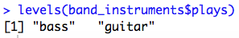


The following is the output of the code mentioned in Step 3:


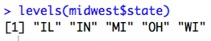


What about ordered categorical variables?

We\'ve used an example of an ordered categorical variable a few times in
this section: a categorical variable that indicates Low/Medium/High is
considered ordered. Say we add a variable to the `mtcars`
dataset that indicates the car\'s speed: low, medium, or high. We\'ll
need to set this variable as a factor. When we do so, the code will be
as follows:

``` 
speed <- rep(c("low", "medium", "high"), times = 11)
speed <- speed[-1]
mtcars$speed <- factor(speed, levels = c("low", "medium", "high"), ordered = TRUE)
```


Now, when we view the class with the `class()` function, we
see that it is now as follows:

``` 
[1] "ordered" "factor"
```


Any time you have a logical order to your factors, it\'s a good idea to
set the `ordered = TRUE` argument.


### Creating an Ordered Factor Variable


Herein, we will create an ordered factor
variable in a dataset. In order to do so, the following steps need to be
executed:


1.  Create a vector called `gas_price` using the following
    code:


``` 
gas_price <- rep(c("low", "medium", "high"), times = 146)
gas_price <- gas_price[-1]
```


It will indicate if gas prices in that area are low, medium, or high on
average.


2.  Add the `gas_price` variable to the `midwest`
    dataset as follows:


``` 
midwest$gas_price <- factor(gas_price,
                                levels = c("low", "medium", "high"),
                                ordered = TRUE)
```


3.  Verify that the variable has been added to the dataset successfully
    using `table()` as follows:


``` 
table(midwest$gas_price)
```


Factor variables are a very important data type in R, since, as we
learned previously, plots often won\'t render correctly unless the
variable is explicitly declared to be a factor, and modeling will
produce incorrect assumptions if a factor variable is not declared as
such.


### Activity: Creating and Manipulating Factor Variables


**Scenario**

You will not be able to avoid using factor
variables in your work programming with R, so
you set out to learn the best ways to create and manipulate them.

**Aim**

To recognize, create, and manipulate factor variables.

**Prerequisites**

Make sure you have R and RStudio
installed on your machine.

**Steps for Completion**


1.  Load the `datasets` library using
    `library(datasets)`.

2.  Load the `diamonds` dataset:
    
    -   Examine the dataset with `str()`.
    -   How many factors are present, and what type are they?
    -   Verify with `class()` that they are of the class
        shown.
    


3.  Load the `midwest` dataset if it is not already loaded in
    your environment:
    
    -   Examine the dataset with `str()`.

    -   Turn all of the character variables into factor variables using
        the `apply()` method for changing many variables at
        once.

    -   Check your work with `str()`.
    


#### Creating Different Tables Using the table() Function


Herein, we will use the `table()` function to
create three different types of tables in
R. In order to do so, the following steps need to be executed:


1.  Load the `iris` dataset and create a one-way table of the
    `Species` variable using the following code:


``` 
table(iris$Species)
```


2.  Load the `diamonds` dataset and create a two-way table of
    the cut and color variables using the following code:


``` 
table(diamonds$cut, diamonds$color)
```


3.  Create a three-way table of the `cut`, `color`,
    and `clarity` variables from the diamonds dataset as
    follows:


``` 
table(diamonds$cut, diamonds$color, diamonds$clarity) 
```


4.  Load the `mtcars` dataset if it is not already loaded in
    your environment. Create a table of the `mpg` variable as
    follows:


``` 
table(mtcars$mpg)
```


**Output**: The following is the output we get as we execute the code mentioned in *Step 1*:


The following is the output we get as we execute the code mentioned in *Step 2*:


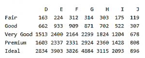


The following is part of the output (it\'s very long) we get as we execute the code mentioned in *Step 3*:


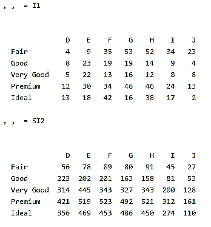


The following is the output we get as we execute the code mentioned in *Step 4*:


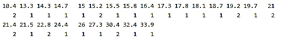


##### Using dplyr Methods to Create Data Summary Tables


We will utilize the `dplyr` verbs to create complex data
summary tables. In order to do so, the following steps need to be executed:


1.  Load the `diamonds` dataset using the following code:


``` 
data(diamonds) 
```


2.  Group the data by `cut`, `color`, and
    `clarity`, and find the number of observations at each
    combination of the three variables, as follows:


``` 
diamonds %>% group_by(cut, color, clarity) %>% summarise(n())
```


3.  Find the mean and median price of diamonds by using the
    `dplyr` functions `group_by()` and
    `summarise()` as follows:


``` 
diamonds %>% group_by(cut) %>% summarise(mean = mean(price), median = median(price))
```


4.  We can also filter out data we\'re not interested in quickly using
    `dplyr` methods. Say we don\'t want any diamonds with
    color `D` or `J`. We can find the mean price by
    cutting all of the diamonds left in the dataset after removing them:


``` 
diamonds %>% filter(color != "D" & color != "J") %>% group_by(cut) %>% summarise(mean = mean(price))
```


**Output**: Data in the `diamonds` dataset grouped
by `cut`, `color`, and `clarity` is as
follows:


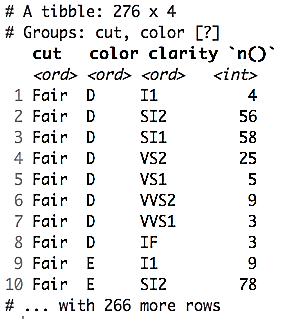


The mean and median price of diamonds is as follows:


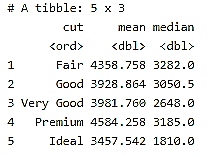


The mean price by `cut` of all of the diamonds left in the dataset after removing them is as follows:


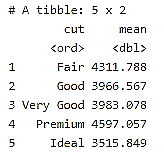


Summary tables are incredibly useful and you\'ll be building a lot of
them as you do data science, both with the base `table()`
function and with the `dplyr` package. The methods covered
here are far from the only way to create data summaries, but are a great
start.


### Activity: Creating Data Summarization Tables


**Scenario**

You\'ve been asked at work to dig deeper into
the diamonds package because your boss is interested in investing
company funds in diamonds. Create some explanatory data tables using
base R and the `dplyr` methods.

**Aim**

To construct basic summary tables by recreating the ones given.

**Prerequisites**

You must have RStudio and R installed on your machine. The datasets
package should also be installed.

**Steps for Completion**


1.  Load the `dplyr` package.
2.  Load the `diamonds` dataset, contained in the
    `datasets` package. Examine the dataset with
    `str()`:


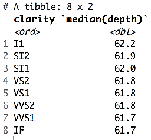


3.  Recreate the following summary tables
    using the `table()` and `dplyr` methods.


   The counts of the diamonds\' clarity by price are as follows:


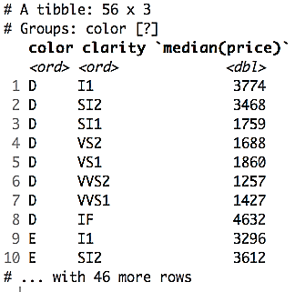


The counts of the diamonds\' clarity by color are as follows:


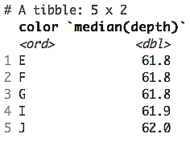


### Summarizing Data with the Apply Family


Let\'s look at a few examples of how to use the apply family to
summarize data. One example of the use of the `apply()`
function would be the following:

``` 
numbers <- rbind(c(1:5), c(2:6)) 
apply(numbers, 2, mean)
```


The output that we get is the small matrix called numbers, which is
represented as follows:


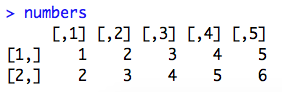


The parameters passed to `apply()`, in this case, can be
explained as follows:


1.  The dataframe or matrix to apply a function on (here,
    `numbers`).
2.  The digit indicating if the function is to be applied on columns or
    rows (here, 2, which in this case means the function will be applied
    over the columns of the data. If we wanted the mean of every row,
    we\'d use 1 as an input instead.)
3.  The function to apply, which in this case is `mean()`.


We used `apply()` here to calculate the mean of every column of the numbers matrix:

``` 
apply(numbers, 2, mean) 
```


Thus, we get the output as follows:


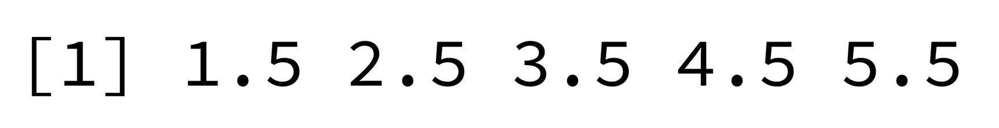


You can also use multiple functions with `apply()`. Here\'s an
example of that:

``` 
apply(numbers, 2, function(x) c(median(x), var(x))) 
```


The output is as follows:


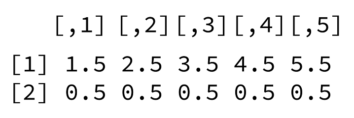


#### Using the apply() Function to Create Numeric Data Summaries


Herein, we will utilize the `apply()` function to summarize a
dataset. In order to so, the following steps
have to be executed:


1.  Load the `iris` dataset using the following code:


``` 
data("iris") 
```


2.  Find the mean of all of the columns of the `iris` dataset
    except the fifth column (the Species column, which isn\'t numeric)
    with the following code:


``` 
apply(iris[,-c(5)], 2, FUN = mean) 
```


3.  Find the mean and variance of all of the columns of `iris`
    except the fifth column as follows:


``` 
apply(iris[,-c(5)], 2, function(x) c(mean(x), var(x))) 
```


4.  Find the mean of all the rows of `iris` as follows:


``` 
apply(iris[,-c(5)], 1, FUN = mean)
```


**Output**: The following is the output we get as we execute
the code mentioned in the second step:


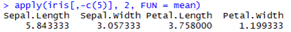


The following is the output we get as we execute the code mentioned in
the third step:


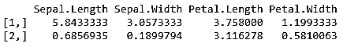


The following is the output we get as we
execute the code mentioned in the second step:


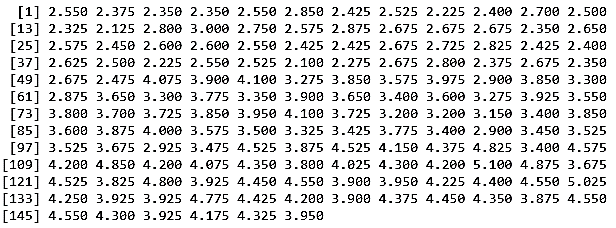


### Activity: Implementing Data Summary


**Scenario**

You need to teach a coworker how to use apply
functions. You write them a reproducible example using the
`mtcars` dataset.

**Aim**

To summarize the variables in the `mtcars` data set using
`apply()`.

**Prerequisites**

Make sure you have R and RStudio installed on your machine. The datasets
package should be installed.

**Steps for Completion**


1.  Load the `mtcars` dataset, if it currently isn\'t loaded
    in your R environment, and examine the data with `str()`.
2.  Use `apply()` to summarize all of the variables in
    `mtcars` that are not categorical. Find the mean and
    variance of each.


Splitting, Combining, Merging, and Joining Datasets
---------------------------------------------------------------------


#### Splitting Datasets into Lists and Then Back Again


Herein, we will utilize the `split()` and
`unsplit()` functions to separate and recreate datasets, and
then use `filter()` from `dplyr` to supplement
knowledge of how to split data.

In order to do so, the following steps have to be executed:


1.  Load the `iris` dataset if it is not currently loaded
    using the following code:


``` 
data(iris) 
```


2.  Split the `iris` dataset by species. This creates three
    lists of dataframes, each of which will only contain the information
    about one species of iris represented in the data. Verify that
    `iris_species` is a list by checking its type and check
    the class of `iris_species[[1]]`. This can be done with
    the help of the following code:


``` 
iris_species <- split(iris, iris$Species) 
typeof(iris_species) 
class(iris_species[[1]]) 
```


3.  Print the head of the second dataframe,
    which contains all the versicolor iris data using the following
    code:


``` 
head(iris_species[[2]]) 
```


4.  Assign each dataframe into its own separate data object. Name the
    dataframes after the species of iris contained inside, as follows:


``` 
iris_setosa <- iris_species[[1]] 
iris_versicolor <- iris_species[[2]] 
iris_virginica <- iris_species[[3]]
```


5.  Use `unsplit()` to recombine `iris_species` into
    `iris_back`, which should be identical to the original
    `iris` dataset. Verify that they are identical using
    `all_equal()` from `dplyr`, which compares every
    aspect of the two dataframes. It can be done using the following
    code:


``` 
iris_back <- unsplit(iris_species, iris$Species) 
library(dplyr) 
all_equal(iris, iris_back)
```


6.  Since `dplyr` is now loaded, recreate the three different
    `iris` datasets using `filter()` on
    `iris` to retain only one species of iris at a time. This
    method involves less code than using `split()` to create a
    list of dataframes by allowing you to create each dataframe
    directly:


``` 
iris_setosa_2 <- iris %>% filter(Species == "setosa") 
iris_versicolor_2 <- iris %>% filter(Species == "versicolor") 
iris_virginica_2 <- iris %>% filter(Species == "virginica")
```


7.  Rejoin the three new iris dataframes by using
    `rbind.as.data.frame()`, and verify that it\'s the same as
    iris by using `all_equal()`:


``` 
iris_back_2 <- rbind.data.frame(iris_setosa_2, iris_versicolor_2, iris_virginica_2) 
all_equal(iris, iris_back_2)
```


**Output**: The following is the output we get as we execute
the code from the second step:


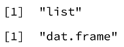


The following is the output we get as we execute the code from the third step:


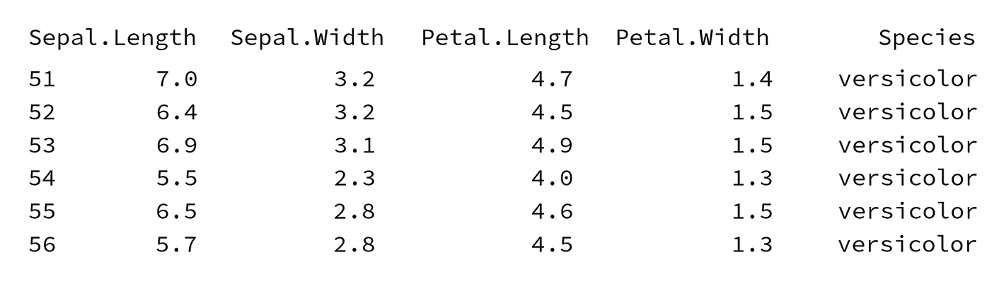


The following is the output we get as we execute the code mentioned in
the sixth step:


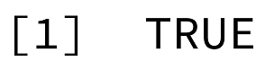


The following is the output we get as we execute the code mentioned in
the seventh step:


#### Combining Data with rbind()


Herein, we will demonstrate the power of `rbind()` for
combining data. In order to do so, the following steps need to be executed:


1.  Install and load the `ggplot2` package, as it contains the
    `midwest` dataset:


``` 
install.packages("ggplot2") 
library(ggplot2) 
```


2.  Load the `midwest` data and examine its contents with
    `str()`:


``` 
 data("midwest") 
 str(midwest) 
```


3.  We\'ll first need to split the data in order to combine it. Let\'s
    split it evenly, in half, to create `midwest_1` and
    `midwest_2`. We can calculate directly in our subsetting
    method to get half of the number of rows of `midwest` in
    each dataset:


``` 
midwest1 <- midwest[1:round(nrow(midwest)/2), ]
midwest2 <- midwest[(round(nrow(midwest)/2)+1):nrow(midwest), ]
```


4.  Recombine `midwest` into `midwest_back` using
    `rbind()` to combine by rows (because we split in half by
    rows!):


``` 
midwest_back <- rbind(midwest1, midwest2)
```


5.  Check to see if `midwest_back` is the same as
    `midwest` using `all_equal()`, like we did
    previously:


``` 
all_equal(midwest, midwest_back)
```


**Output**: The following is the output we get as we execute the code mentioned in *Step 2*:


The following is the output we get as we execute the code mentioned in *Step 5*: 


#### Combining Matrices of Objects into Dataframes


Herein, we will use `rbind()` and `cbind()`, plus
their associated `data.frame` methods, to combine multiple R
objects into dataframes. In order to do so, the following
steps have to be executed:


1.  Create one, two, three, and four, which are all vectors of
    sequential numbers:


``` 
one <- 1:15 
two <- 16:30 
three <- 31:45 
four <- 46:60 
```


2.  Create `all1` and `all2` from one, two, three,
    and four. `all1` should be combined by rows, while
    `all2` should be combined by columns:


``` 
all1 <- rbind(one, two, three, four) 
all2 <- cbind(one, two, three, four) 
```


3.  Check the class of `all1`:


``` 
class(all1)
```


4.  Recombine one, two, three, and four into `data.frames` and
    look at the class of `all3`:


``` 
all3 <- rbind.data.frame(one, two, three, four) 
all4 <- cbind.data.frame(one, two, three, four) 
class(all3)
```


**Output**: The following is the output we get as we execute
the code `class(all1)`:


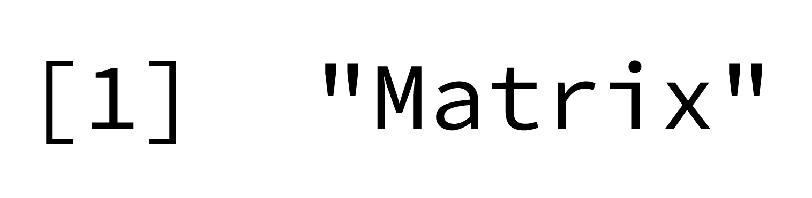


The following is the output we get as we execute the code mentioned in the last *Step 4*:


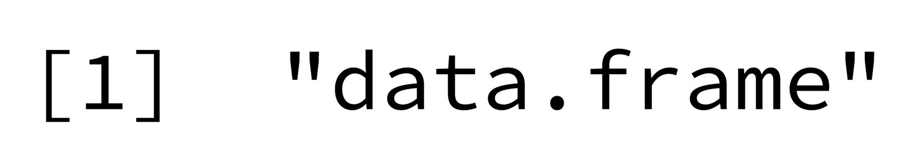


#### Using stringr Package to Manipulate a Vector of Names


Herein, we will utilize the `str_split()` function to learn
how to split character strings in R. In order to do so, the following
steps need to be executed:


1.  Install and then load the `stringr` package:


``` 
install.packages("stringr") 
library(stringr)
```


2.  Create the names vector, a list of various names, and check its
    length to see how many names it contains:


``` 
names <- c("Danelle Lewison", "Reyna Wieczorek", "Jaques Sola", "Marcus Huling", "Elvis Driver", "Chandra Picone", "Alejandro Caffey", "Shawnna Lomato", "Masako Hice", "Wally Ota", "Phillip Batten", "Denae Rizzuto", "Joseph Merlos", "Maurice Debelak", "Carina Gunning", "Tama Moody") length(names) 
```


3.  Use `str_split()` to separate each name into first name
    and surname and save it as an object called `names_split`.
    `str_split()` takes two arguments: the vector (or
    character string) you plan to split, and a pattern to split on:


``` 
names_split <- str_split(names, pattern = " ") 
```


4.  Examine the first split name in `names_split`. Then, look
    at the first name. Remember to use list indexing, as
    `names_split` is a list of the split first
    names and surnames:


``` 
names_split[[1]] 
names_split[[1]][1]
```


5.  Split create `names_split_a`, which splits names at any as
    in each name. You only have to change one of the inputs to
    `str_split()` that you used previously:


``` 
names_split_a <- str_split(names, pattern = "a") 
```


6.  Examine the first split name and the second half of the first split
    name in `names_split_a` once more. How has it been split
    differently?


``` 
names_split_a[[1]] names_split_a[[1]][2] 
```


7.  Now, examine the fifth split name from `names_split_a`.
    What happened with this name that has no a in it?


``` 
names_split_a[[5]] 
```


**Output**: The following is the output we get upon executing
the code mentioned in *Step 2*:


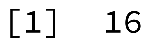


The following is the output we get upon executing the code mentioned in *Step 4*:


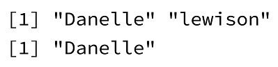


The following is the output we get upon executing the code mentioned in *Step 6*:


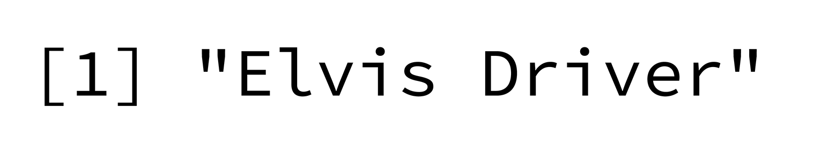


#### Combining Strings Using Base R Methods


Herein, we will use `paste()` and `paste0()` with
character objects, character strings, and integers. In order to do so,
the following steps have to be executed:


1.  Create variables `a`, `b`, and `c`,
    which contain character strings:


``` 
a <- "R" b <- "is" c <- "fun" 
```


2.  Use `paste()` to combine `a`, `b`, and
    `c` with an exclamation mark:


``` 
paste(a, b, c, "!") 
```


3.  Use `paste0()` to do the same, but without spaces between
    `a`, `b`, `c`, and the exclamation
    mark:


``` 
paste0(a, b, c, "!")
```


4.  Use `paste()` to create the string
    `"R is fun x 10"` with the objects you\'ve created:


``` 
paste(a, b, c, "x", 10)
```


**Output**: The following is the output we get upon executing
the code mentioned in *Step 2*:


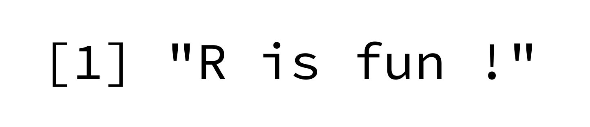


The following is the output we get upon
executing the code mentioned in *Step 3*:


The following is the output we get upon executing the code mentioned in *Step 4*:


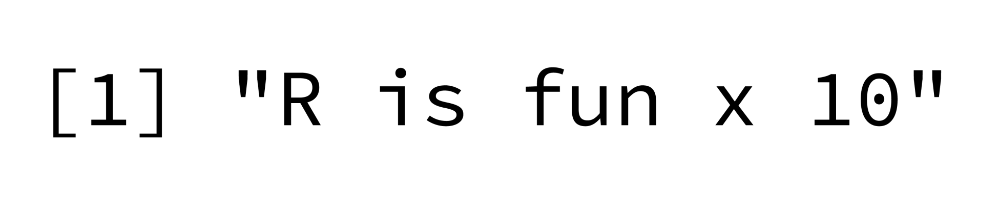


### Activity: Demonstrating Splitting and Combining Data


**Scenario**

You need to split the `mtcars` dataset by cylinder type for a
project. You also want to recombine the datasets to understand the power of
combining data in R.

**Aim**

To get comfortable with both splitting and combining datasets.

**Prerequisites**

Make sure you have R and RStudio installed on your machine.

**Steps for completion**


1.  Load the `mtcars` dataset.
2.  Split the data by the `cyl` variable.
3.  Create a dataset for each level of `cyl`.
4.  Recreate `mtcars` by unsplitting the split version of the data.
5.  Create the following two datasets by
    combining the data:


    `letters1` dataset:


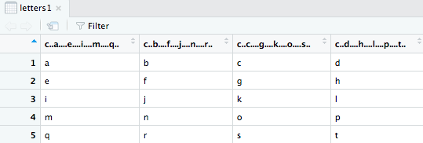


`letters2` dataset:


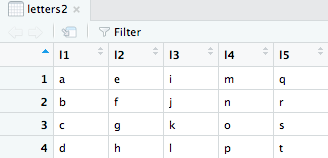


### Demonstrating Merges and Joins in R


Herein, we will use the base R `merge()` function and the
`dplyr` join functions to work out how to merge and join data in R, comparing and contrasting the two
functions throughout.

In order to do so, the following steps need
to be executed:


1.  Install and load the `readr` package, which contains
    functions that read in data much faster than the `baseR`
    data read functions:


``` 
install.packages("readr") 
library(readr)
```


2.  Download the `students` and `students2` datasets
    from the GitHub repository:


``` 
students <- read_csv("https://raw.githubusercontent.com/ 
fenago/R-Programming/master/lesson3/students.csv") 
students2 <- read_csv("https://raw.githubusercontent.com/ 
fenago/R-Programming/master/lesson3/students2.csv")
```


3.  Examine both datasets using `str()`. Verify that they each
    has an `ID` variable, and take note that students has
    information about 20 students (20 observations), while
    `students2` has information on five additional students
    (25 observations):


``` 
str(students) 
str(students2)
```


4.  Create `students_combined` by merging the two datasets by
    `ID`. Check the dimensions of students combined to see how
    many students\' information is retained on this inner join. There
    should only be 20 matches on ID between the two datasets on this
    default inner join:


``` 
students_combined <- merge(students, students2, by = "ID") 
dim(students_combined)
```


5.   Create `students_combined2`, this time performing a right
    join using `merge()`, which should retain all of the
    possible students\' information. Check the dimensions to
    see how much of students\' information is
    in the combined dataset. Does it match up
    with your expectations?


``` 
students_combined2 <- merge(students, students2, by = "ID", all.y = TRUE) dim(students_combined2)
```


 You\'ll see the following output:


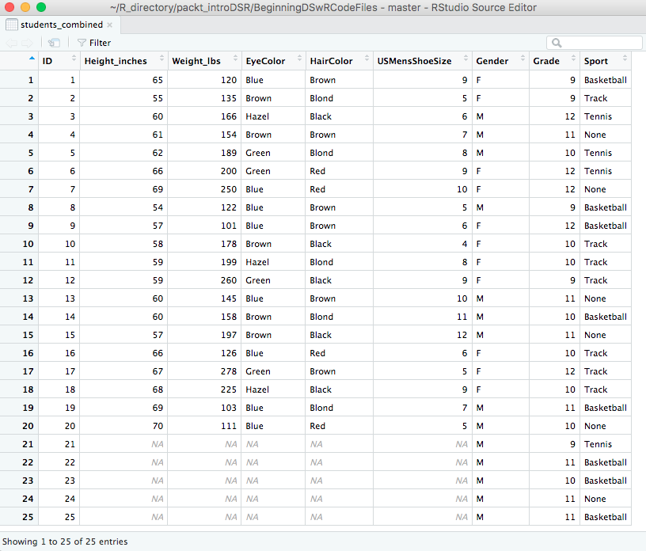


6.  Install and load the `dplyr` package, if you have not done
    either of these already:


``` 
install.packages("dplyr") 
library(dplyr)
```


7.  Create `students_right_join`, performing another right
    join, but this time using the `dplyr` join methods. Check
    the dimensions to verify the number of students\' information in the
    joined dataset:


``` 
students_right_join <- right_join(students, students2, by = "ID") 
dim(students_right_join)
```


8.  Create `students_anti_join` similarly and check the
    dimensions. Based on the preceding table, is the output what you
    expected?


``` 
students_anti_join <- anti_join(students, students2, by = "ID") dim(students_anti_join)
```


9.  If the by variables are named the same
    things, you can actually do both merges and joins without specifying
    a by variable:


``` 
students_merge_noby <- merge(students, students2)
students_join_noby <- right_join(students, students2)
```


10. Rename the `ID` variable on students to be called
    `StudentID`. Now, merge and join the data
    using the slightly different by variable
    names to see how powerful merge and join functions truly are:


``` 
colnames(students)[6] <- "StudentID"
students_merge_diff <- merge(students, students2, by.x = "StudentID", by.y = "ID")
students_join_diff <- right_join(students, students2, by = c("StudentID" = "ID"))
```


**Output**: The following is the `students` dataset
as an output:

``` 
Classes 'tbl_df', 'tbl' and 'data.frame': 20 obs. of 6 variables: $ Height_inches : int 65 55 60 61 62 66 69 54 57 58 ... $ Weight_lbs : int 120 135 166 154 189 200 250 122 101 178 ... $ EyeColor : chr "Blue" "Brown" "Hazel" "Brown" ... $ HairColor : chr "Brown" "Blond" "Black" "Brown" ... $ USMensShoeSize: int 9 5 6 7 8 9 10 5 6 4 ... $ ID : int 1 2 3 4 5 6 7 8 9 10 ...
```


The following is the `students2` dataset as an output:

``` 
'data.frame': 25 obs. of 4 variables: $ ID : int 1 2 3 4 5 6 7 8 9 10 ... $ Gender: Factor w/ 2 levels "F","M": 1 1 1 1 1 1 1 1 1 2 ... $ Grade : num 10 10 9 10 12 9 12 12 11 10 ... $ Sport : Factor w/ 4 levels "Basketball","None",..: 4 3 3 1 1 4 4 3 4 3 ... 4. [1] 20 9 5. [1] 25 9 7. [1] 25 9 8. [1] 0 6 9b. Joining, by = "ID"
```


### Activity: Merging and Joining Data


**Scenario**

You work at a school, where you\'ve been
tasked with updating the data for one of the high school English
classes. Use your merging and joining skills to get the data in the
final state your boss requires.

**Aim**

To practice merging and joining datasets. Prerequisites Make sure that R
and RStudio are installed on your machine.

**Steps for Completion**


1.  Re-import the `students` dataset from the repository on
    GitHub. The best way to do this is by using the following code:


``` 
read_csv("https://github.com/fenago/R-Programming/blob/master/lesson1/students.csv")
```


**Note:**

  To use this code, you have to load the `readr` package!


Add an `id` variable to students equal to the number of rows
of students.


2.  Navigate to `lesson3_activityC2.R` on GitHub to get the
    code you need to create the second and third students datasets.
3.  Merge the three datasets until you arrive
    at one with 16 rows and 12 variables:


The variables should be in the following
order: `StudentID`, `Height_ inches`, `Weight_lbs`, `EyeColor`, `HairColor`, `USMensShoeSize`, `Gender`, `Grade`, `Sport`, `HomeroomTeacher`, `ACTScore`, `CollegePlans`. 


4.  Join the datasets until you arrive at one
    with 25 rows and 12 variables:


The variables should be in the following
order: `Height_inches`, `Weight_lbs`, `EyeColor`, `HairColor`, `USMensShoeSize`, `StudentID`, `HomeroomTeacher`, `ACTScore`, `CollegePlans`, `Gender`, `Grade`, `Sport`.


Summary
-------------------------


Data management is a crucial skill needed for working with data in R,
and we have covered many of the basics in this lab. One thing to
keep in mind is that there is no prescribed order in which to conduct
data management, cleaning, and data visualization. Rather, it will be an
iterative process that likely won\'t end, even if you continue with your
data and perform data analysis projects. You will probably run across
more questions about your data if you use it to build statistical
models.

This course has taken you through variable types, basic flow control, data import and export,
data visualization with base plots and ggplot2, summarizing and
aggregating data, plus joins and merging to help you build a foundation
for how to use R to work with data.
