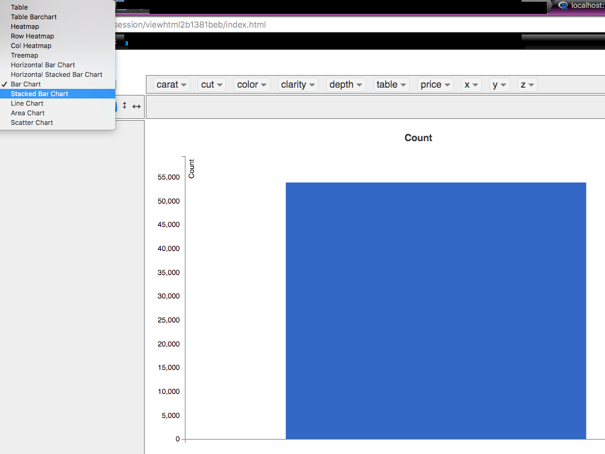
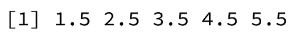
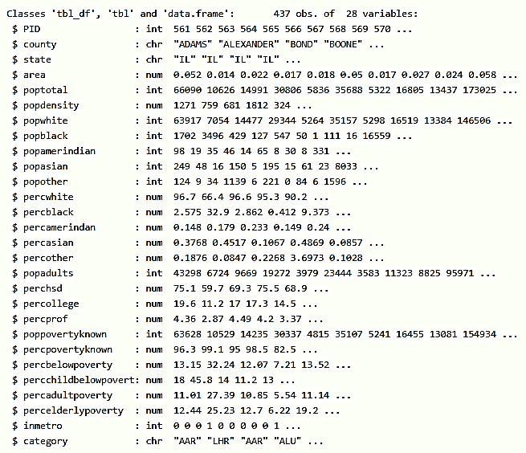
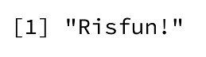
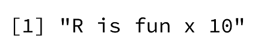
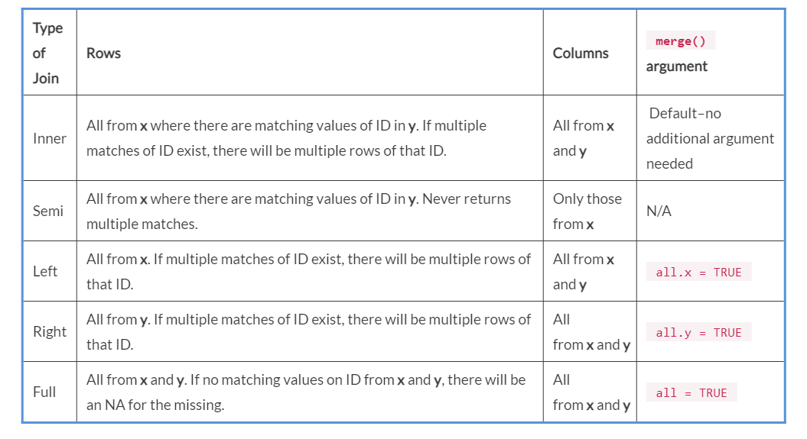

Lab 3. Data Management
-----------------------------------


In Lab 2, it was mentioned that
data visualization is a key part of EDA. The techniques for data
management we\'ll discuss in this lab constitute the other important
parts of EDA, which you should always do prior to modeling and analysis.
In this lab, we will address what a factor variable is and how to
use one, how to summarize your data numerically, how to combine, merge,
and split datasets, and how to split and combine strings.

By the end of this lab, you will be able to:


-   Create and reorder factor variables
-   Generate pivot tables
-   Aggregate data using the base and dplyr packages
-   Use various methods to split, apply, and combine data in R
-   Split character strings using the stringr package
-   Merge and join different datasets using base R and the dplyr methods


Factor Variables
----------------------------------


We discussed variable types in Lab 1 but did not include factor variables
because they\'re a special type of variable in R that you must often
create yourself. In this section, we\'ll learn what a factor variable
is, when to use a factor variable, how to
create one, what the levels of a factor are, and how to change the
levels.

A factor variable in R is an explicitly declared categorical variable,
or one that defines different categories or levels. Some common examples
of factor variables include a variable describing sex, month, or one
designating low/medium/high.

Recall our discussion of variable classes and types from Lab 1. A factor variable will always be of
class `factor`, but can be any type: `character`,
`numeric`, `integer`, or otherwise. For example, a
variable indicating month can have the months as type
`character` (`"January"`, `"February"`,
\...) or can be indicated with integers (`1`, `2`,
`3`, ...).


**Note:**

You can access the class of an object, variable, dataset, or just about
anything else in R using this
code: `class(dataset$variable_name)` You can find out the type
of the variable using this code:
`typeof(dataset$variable_name)`


Let\'s learn more about what factor variables are and how to use them.

Let\'s return to the `mtcars` and `iris` datasets,
both of which we\'ve used previously. (They\'re very common examples of
datasets that are used in R, if you haven\'t caught on to that yet!)
After loading, let\'s examine each dataset with the method
`str()`, as follows:

``` 
data("mtcars")
str(mtcars)
data("iris")
str(iris)
```


`mtcars` has no factor variables specified out of the box, but
the Species variable in the `iris` dataset is explicitly
declared to be a factor variable with three levels: `setosa`,
`versicolor`, and, if we could see it, `virginica`.
We can see all three by using the `levels()` function, as
shown in the following screenshot:


Recall that in Lab 2, we examined plotting
with factor variables: if you insert a factor into the generic
`plot()` function, you get a bar chart instead of a scatter plot, where the bar chart shows counts
of each observation at unique levels of the factor variable.

Since we\'ve discussed what a factor variable is, let\'s go through some
other questions you may have about factors.

**When Should You Use a Factor Variable?**

The cylinder variable in `mtcars` can be turned into a factor
variable because there are only three values the cylinder variable can
take. These are four, six, and eight cylinders; this
means that this is a
[*categorical*] variable, another word for a factor variable.
The cars in this dataset are either four-, six-, or eight-cylinder cars.
The `mpg` variable in the same dataset wouldn\'t be a good
candidate for a factor variable because it isn\'t categorical and it is
the numeric value of the miles per gallon of each car.

Any time you have a character variable that has a set number of
categories for that variable, for example, [*Months*] = [*12
months*], [*Sex*] = [*2 sexes*], [*3
levels*]: [*Low*], [*Medium*], and
[*High*], and so on, you can (and should!) transform that
variable into a factor variable in R.

**Why Should You Use a Factor Variable?**

Besides the fact that it\'s helpful to
explicitly declare your categorical variables so that these are obvious
when you view a summary of a dataset (using `str()` or
`dplyr::glimpse()`), there are two critical reasons to use
factor variables.

Firstly, functions such as `lm()` and `glm()` (among
others) that build statistical models in R treat a categorical variable
coded with numbers (for example, Months as 1, 2, 3, ...) as a continuous
variable if you don\'t explicitly declare the variable to be a factor
variable. This will produce erroneous model estimates and lead to
incorrect conclusions.

For example, let\'s build a linear regression
model to examine the relationship between the number of cylinders
(`cyl`) and miles per gallon (`mpg`) in cars in the
`mtcars` dataset. We\'ll use `cyl` both as an
integer variable and as a factor variable.

We can use `cyl` as an integer variable as follows:

``` 
summary(lm(mpg ~ cyl, data = mtcars))
```


The output is as follows:


We can use `cyl` as a factor variable as follows:

``` 
summary(lm(mpg ~ as.factor(cyl), data = mtcars))
```


The output is as follows:


However, only the output where we\'ve used `cyl` as a factor
variable is the correct model output. We want the model to know that
that cylinder is a factor and measures the difference in miles per gallon between four and six cylinders and four
and eight cylinders; this is the correct way to build the model.

When a variable is categorical and is coded with text, for example,
`Months = "January"`, `"February"`,
`"March"`, and so on, modeling functions in R automatically
treat the variable as categorical, but you should still code it as a
factor variable. This is because of the second reason for using factors.

Plots will not render correctly with either base plots or
`ggplot2` plots if you do not have your factor variables
explicitly declared.

We can rerun the code to plot the `cyl` variable without
transforming it into a factor, as follows:

``` 
plot(mtcars$cyl)
```


We get the scatterplot as an output, as shown in the following
screenshot:


This doesn\'t really tell us anything about
the variable. Similarly, if we try to create a graph using
`ggplot2`, for example, by using a boxplot of `mpg`
by `cyl` without transforming it into a factor, we\'ll get a
warning:


The plot will be only one boxplot, because there\'s no group variable.
Again, this is incorrect and uninformative. Thus, we should change
`cyl` into a factor variable using `as.factor()`, as
follows:

``` 
ggplot(mtcars, aes(as.factor(cyl), mpg)) + geom_boxplot()
```


Here is the boxplot we are looking for:


Now that we know when and why to use a factor
variable, let\'s learn how to create one.

**How Should You Create a Factor Variable?**

We\'ve seen many times in this lab and the preceding one that we can
create factor variables using the `as.factor()` method. The
input can be a variable from a dataset or a vector of values.

Typically, when you want to change a variable
in a dataset to a factor, you overwrite the variable or create a second
one. For example, to change the `cyl` variable in
`mtcars` to a factor, you could either overwrite it or create
another variable, as follows:


1.  Overwrite the `cyl` variable and create it as a factor
    using the following code:


``` 
mtcars$cyl &lt;- as.factor(mtcars$cyl)
```


2.  Create a second variable, `cyl2`, which will be a factor
    version of the original `cyl` variable as follows:


``` 
mtcars$cyl2 &lt;- as.factor(mtcars$cyl)
```


**Note:**

Whether you overwrite the original variable or create a second variable
is up to you and will depend on the project, storage constraints, and
your preferences. If you choose to overwrite the original variable, be
sure to have a copy of the original dataset backed up in case something
goes wrong!


Often, it will be the case that you\'d like to transform more than one
variable in your dataset into factor variables. To do this, you have a
few options. For example, the variables `cyl`, `am`,
and `gear` in the `mtcars` dataset are all
categorical and should be transformed to factors. A good way to do this
is by using the following code:

``` 
factors &lt;- c("cyl", "am", "gear") 
mtcars[,factors] &lt;- data.frame(apply(mtcars[,factors], 2, as.factor))
```


Here, first, you create a vector of the names of variables you\'d like
to turn into factors, called `factors`. Then, using
`data.frame()`, which creates a data frame, you apply the
`as.factor()` function to only the desired columns of the
dataset `mtcars`, which are accessed using
`mtcars[,factors]`.

The `apply` family of functions provides an efficient way to
perform another function on multiple rows or columns of a dataset at
once. The input `2` indicates to `apply()` that
`as.factor()` should be applied to columns of the dataset
`mtcars`. If we had input `1`,
`as.factor()` would be applied to rows of `mtcars`
instead (and likely, this would have returned an error). Applying
`as.factor()` by row doesn\'t really make sense if you think
about a row of a dataset. A row of `mtcars` contains all of
the information about the car: its `mpg`, `cyl`,
`disp`, `hp`, and so on, and only
some of these variables are
factor/categorical variables. This logic will apply to most datasets you
use!

We can check to be sure this worked by using `str()` as
follows:

``` 
str(mtcars)
```


We see that the variables `cyl`, `am`, and
`gear` are now all factor variables, as shown in the following
screenshot:


### Creating Factor Variables in a Dataset


Herein, we will create factor variables in a
dataset both one at a time and by using a method that converts multiple
variables at once. In order to do so, the following steps have to be
executed:


1.  Load the `datasets` library:


``` 
library(datasets)
```


2.  Load the `midwest` dataset and examine it with
    `str()`:


``` 
data(midwest) 
str(midwest)
```


3.  Convert the `state` variable to a factor by using
    `as.factor()`:


``` 
midwest$state &lt;- as.factor(midwest$state)
```


4.  Load the `band_instruments` dataset and examine it with
    `str()`:


``` 
data(band_instruments)
str(band_instruments)
```


5.  Transform both variables in `band_instruments` to factor
    variables using `apply()`:


``` 
band_instruments &lt;- data.frame(apply(band_instruments, 2, as.factor))
```


6.  Double-check that [*Step 5*] worked using
    `str()`:


``` 
str(band_instruments)
```


**Output**: The following is the output of the
code mentioned in [*Step 2*]:


The following is the output of the code mentioned in [*Step
4*]:


The following is the output of the code
mentioned in [*Step 5*]:


**How Do You Know if Something is Already a Factor?**

You can check if a variable or vector of
values is already a factor by using `is.factor()`. It will
return `TRUE` or `FALSE` accordingly. Alternatively,
you can check the class using `class()` or use
`str()` to view either the entire dataset\'s variable names
and types (if you input the dataset name) or just the one variable (if
you only input that):


**What are the Levels of a Factor, and How Can You Change
Them?**

The levels of a factor are the particular
categories for that variable. They are a special attribute of factor
objects in R. You can view them with the `levels()` function,
as shown in the following example:

``` 
levels(iris$Species)
```


It returns the three species of irises indicated in the
`Species` variable column, as follows:

 


If we want to change the levels of the
factor, we can do so in two ways:


-   Using `ifelse()` statements

-   Using the `recode()` function


#### Using ifelse() Statements


The following code will change the
representation of the three species to numbers:

``` 
iris$Species2 &lt;- ifelse(iris$Species == "setosa", 1,
ifelse(iris$Species == "versicolor", 2, 3))
```


We can verify if it has worked by running the `table()`
function as follows (more on this function in the next section!):

``` 
table(iris$Species)
```


Thus, we will get the following output:


We can also execute the following code to verify whether the
representation has changed:

``` 
table(iris$Species2)
```


Here is the output that we will get:


#### Using the recode() Function


The `recode()` function, available in the `dplyr`
package, can change the level of the factor by using more readable code, as follows:

``` 
library(dplyr)
iris$Species3 &lt;- recode(iris$Species,
                        "setosa" = 1,
                        "versicolor" = 2,
                        "virginica" = 3)
```


These are both valid options, and which one you use is up to you.


### Examining and Changing the Levels of Pre-existing Factor Variables


Herein, we will create factor variables in a
dataset both one at a time and by using a
method that converts multiple variables at once. In order to do so, the
following steps have to be executed:


1.  Load the `dplyr` library. Use `levels()` to see
    how many levels of `band_instruments$plays` exist, as
    follows:


``` 
levels(band_instruments$plays)
```


2.  Create a new variable, `plays2`, using
    `ifelse()` to change the levels bass and guitar to 1 and 2
    using the following code:


``` 
band_instruments$plays2 &lt;- ifelse(band_instruments$plays == "bass", 1,
ifelse(band_instruments$plays == "guitar", 2, band_instruments$plays))
```


3.  Use `levels()` to see how many levels of
    `midwest$state` exist as follows:


``` 
levels(midwest$state)
```


4.  Load the `dplyr` library. Create a new variable,
    `state2`, by using `recode()` to change the
    levels of the state variable to the states\' full names:


``` 
library(dplyr)
midwest$state2 &lt;- recode(midwest$state,
                         "IL" = "Illinois",
                         "IN" = "Indiana",
                         "MI" = "Michigan",
                         "OH" = "Ohio",
                         "WI" = "Wisconsin")
```


**Output**: The following is the output of the code mentioned in [*Step
1*]:


The following is the output of the code mentioned in [*Step
3*]:


What about ordered categorical variables?

We\'ve used an example of an ordered categorical variable a few times in
this section: a categorical variable that indicates Low/Medium/High is
considered ordered. Say we add a variable to the `mtcars`
dataset that indicates the car\'s speed: low, medium, or high. We\'ll
need to set this variable as a factor. When we do so, the code will be
as follows:

``` 
speed &lt;- rep(c("low", "medium", "high"), times = 11)
speed &lt;- speed[-1]
mtcars$speed &lt;- factor(speed, levels = c("low", "medium", "high"), ordered = TRUE)
```


Now, when we view the class with the `class()` function, we
see that it is now as follows:

``` 
[1] "ordered" "factor"
```


Any time you have a logical order to your factors, it\'s a good idea to
set the `ordered = TRUE` argument.


### Creating an Ordered Factor Variable


Herein, we will create an ordered factor
variable in a dataset. In order to do so, the following steps need to be
executed:


1.  Create a vector called `gas_price` using the following
    code:


``` 
gas_price &lt;- rep(c("low", "medium", "high"), times = 146)
gas_price &lt;- gas_price[-1]
```


It will indicate if gas prices in that area are low, medium, or high on
average.


2.  Add the `gas_price` variable to the `midwest`
    dataset as follows:


``` 
midwest$gas_price &lt;- factor(gas_price,
                                levels = c("low", "medium", "high"),
                                ordered = TRUE)
```


3.  Verify that the variable has been added to the dataset successfully
    using `table()` as follows:


``` 
table(midwest$gas_price)
```


Factor variables are a very important data type in R, since, as we
learned previously, plots often won\'t render correctly unless the
variable is explicitly declared to be a factor, and modeling will
produce incorrect assumptions if a factor variable is not declared as
such.


### Activity: Creating and Manipulating Factor Variables


**Scenario**

You will not be able to avoid using factor
variables in your work programming with R, so
you set out to learn the best ways to create and manipulate them.

**Aim**

To recognize, create, and manipulate factor variables.

**Prerequisites**

Make sure you have R and RStudio
installed on your machine.

**Steps for Completion**


1.  Load the `datasets` library using
    `library(datasets)`.

2.  Load the `diamonds` dataset:
    
    -   Examine the dataset with `str()`.
    -   How many factors are present, and what type are they?
    -   Verify with `class()` that they are of the class
        shown.
    


3.  Load the `midwest` dataset if it is not already loaded in
    your environment:
    
    -   Examine the dataset with `str()`.

    -   Turn all of the character variables into factor variables using
        the `apply()` method for changing many variables at
        once.

    -   Check your work with `str()`.
    


Summarizing Data
----------------------------------


A huge component of data management and
cleaning is summarizing your data. It\'s hard to know what\'s really
inside data just by looking at it. If you\'re a frequent user of
Microsoft Excel, you might be familiar with creating pivot tables to
summarize data and get a feel for what\'s inside your dataset. We won\'t
use pivot tables with R in this course, but it is possible.

There are various R functions and R packages that allow for the creation
of different types of tables to examine data. You can also use the
`apply` family of functions to generate summaries.


### Data Summarization Tables


If you\'re familiar with Microsoft Excel, you may have some experience
building pivot tables. It\'s possible to create them in R using the `rpivotTable` package, as
shown in the following screenshot:





If you install it along with the `htmlwidgets` package, you
can create pivot tables with multiple options and look at stats. It\'s
interesting, but you\'ll also need to know how to manipulate data
yourself. The rest of this section will focus on building the various
kinds of summaries using tools other than `rpivotTable`.

What kind of data summarization you\'ll need to use will strongly depend
on the goals of your data project. Building a logistic regression model
using the classic Titanic passengers\' dataset to predict survival?
You\'re going to need to look at sex, passenger class, and age, both on
their own and some combination of the three. (We\'ll clean this dataset
later in this lab.) Writing a report summarizing yearly sales data
for the leadership at your company? Look for trends by month, quarter,
customer, and product type. You\'ll need to ask yourself questions about
what kinds of data summarizations (and visualizations!) are appropriate
and needed. You may not think of them all at once. In fact, EDA is often
an iterative process that will happen continuously across data cleaning,
modeling, and analysis, and report writing stages of data science.


#### Tables in R


Tables in R are very helpful when you want to create a grid of counts of one or two categorical variables. They
can be saved as an object for export or in combination with other
summary tables.

We\'ve used the `iris` dataset numerous times by now, and have
observed that there are 50 of each species of flower in the data. To
create a table to verify it, use the `table()` function. If
you input a variable of interest to `table()`, R will return a
table of the values of the input variable with a count of how many
observations have that particular value.

You can also create two-way tables, though we\'ll need to use a
different dataset, as there\'s only one categorical variable in iris. To
create a two-way variable, input two different variables from a dataset
into `table()`. The first variable input will be shown as the
table\'s rows, and the second variable input will be shown as the
table\'s columns.

However, there are a few disadvantages of the `table()`
function. They are as follows:


-   It doesn\'t show missing variables unless they\'re explicitly
    declared as a level of the variable in some way.

-   Anything above what a two-way table, that is, a table with two
    variables, prints is hard to read. You will see an example of this
    in the following example. 

-   It prints a long, uninformative table for a continuous variable
    should you enter one into the function. It won\'t be helpful to know
    how many values there are of a variable when it\'s continuous.


##### Creating Different Tables Using the table() Function


Herein, we will use the `table()` function to
create three different types of tables in
R. In order to do so, the following steps need to be executed:


1.  Load the `iris` dataset and create a one-way table of the
    `Species` variable using the following code:


``` 
table(iris$Species)
```


2.  Load the `diamonds` dataset and create a two-way table of
    the cut and color variables using the following code:


``` 
table(diamonds$cut, diamonds$color)
```


3.  Create a three-way table of the `cut`, `color`,
    and `clarity` variables from the diamonds dataset as
    follows:


``` 
table(diamonds$cut, diamonds$color, diamonds$clarity) 
```


4.  Load the `mtcars` dataset if it is not already loaded in
    your environment. Create a table of the `mpg` variable as
    follows:


``` 
table(mtcars$mpg)
```


**Output**: The following is the output we get as we execute
the code mentioned in[*Step 1*]:


The following is the output we get as we execute the code mentioned in
[*Step 2*]:


The following is part of the output (it\'s very long) we get as we
execute the code mentioned in [*Step 3*]:


The following is the output we get as we execute the code mentioned in
[*Step 4*]:


For any table above a two-way (or two - variable) table, you\'re better
off turning to methods provided by the `dplyr` package. For
example, if we wanted the counts for diamonds by `cut`,
`color`, and `clarity`, it\'s easier to read a table
that\'s been created with `dplyr` methods. `dplyr`
will automatically print to the console, but if you\'d like to access
the tables you create later, you\'ll need to save the output to
your environment. There is a lot of data
summarizing that can be accomplished with the `dplyr` package.
Let\'s learn some of the things it can accomplish in the section.


##### Using dplyr Methods to Create Data Summary Tables


We will utilize the `dplyr` verbs to create complex data
summary tables. In order to do so, the following steps need to be executed:


1.  Load the `diamonds` dataset using the following code:


``` 
data(diamonds) 
```


2.  Group the data by `cut`, `color`, and
    `clarity`, and find the number of observations at each
    combination of the three variables, as follows:


``` 
diamonds %&gt;% group_by(cut, color, clarity) %&gt;% summarise(n())
```


3.  Find the mean and median price of diamonds by using the
    `dplyr` functions `group_by()` and
    `summarise()` as follows:


``` 
diamonds %&gt;% group_by(cut) %&gt;% summarise(mean = mean(price), median = median(price))
```


4.  We can also filter out data we\'re not interested in quickly using
    `dplyr` methods. Say we don\'t want any diamonds with
    color `D` or `J`. We can find the mean price by
    cutting all of the diamonds left in the dataset after removing them:


``` 
diamonds %&gt;% filter(color != "D" & color != "J") %&gt;% group_by(cut) %&gt;% summarise(mean = mean(price))
```


**Output**: Data in the `diamonds` dataset grouped
by `cut`, `color`, and `clarity` is as
follows:


The mean and median price of diamonds is as follows:


The mean price by `cut` of all of the diamonds left in the dataset after removing them is as follows:


Summary tables are incredibly useful and you\'ll be building a lot of
them as you do data science, both with the base `table()`
function and with the `dplyr` package. The methods covered
here are far from the only way to create data summaries, but are a great
start.


### Activity: Creating Data Summarization Tables


**Scenario**

You\'ve been asked at work to dig deeper into
the diamonds package because your boss is interested in investing
company funds in diamonds. Create some explanatory data tables using
base R and the `dplyr` methods.

**Aim**

To construct basic summary tables by recreating the ones given.

**Prerequisites**

You must have RStudio and R installed on your machine. The datasets
package should also be installed.

**Steps for Completion**


1.  Load the `dplyr` package.
2.  Load the `diamonds` dataset, contained in the
    `datasets` package. Examine the dataset with
    `str()`:


3.  Recreate the following summary tables
    using the `table()` and `dplyr` methods.


   The counts of the diamonds\' clarity by price are as follows:


The counts of the diamonds\' clarity by color are as follows:


### Summarizing Data with the Apply Family


The apply family of functions is an incredibly powerful set of R
functions that you should learn early on in
your R programming journey. It\'ll be very helpful to be skilled in
summarizing across many variables at once. This is where the apply
family of functions comes in.

The apply family is a set of functions that allows you to perform
aggregating (using `mean()`, `sum()`, and other
summary functions), transforming or sub-setting, and other functions
(including custom functions!) across a large range of your dataset. The
family of functions includes basic functions such as
`apply()`, but also `lapply()`,
`sapply()`, `vapply()`, `mapply()`,
`rapply()`, and `tapply()`. Mostly, the difference
between these different functions is that they return different things
when they are called. For example, `lapply()` returns a list
and `vapply()` returns a vector. There are a few other
differences, but for the purpose of this lab, they won\'t be as
important.

Let\'s look at a few examples of how to use the apply family to
summarize data. One example of the use of the `apply()`
function would be the following:

``` 
numbers &lt;- rbind(c(1:5), c(2:6)) apply(numbers, 2, mean)
```


The output that we get is the small matrix called numbers, which is
represented as follows:


The parameters passed to `apply()`, in this case, can be
explained as follows:


1.  The dataframe or matrix to apply a function on (here,
    `numbers`).
2.  The digit indicating if the function is to be applied on columns or
    rows (here, 2, which in this case means the function will be applied
    over the columns of the data. If we wanted the mean of every row,
    we\'d use 1 as an input instead.)
3.  The function to apply, which in this case is `mean()`.


We used `apply()` here to calculate the mean of every column of the numbers matrix:

``` 
apply(numbers, 2, mean) 
```


Thus, we get the output as follows:





You can also use multiple functions with `apply()`. Here\'s an
example of that:

``` 
apply(numbers, 2, function(x) c(median(x), var(x))) 
```


The output is as follows:


Here, the first two inputs to `apply()` are the same, but we
have to write a custom function that takes in a `dataset(x)`
and then computes the median and variance of the columns (because we
input 2 in the second input to `apply()`) of the dataset.

In the preceding output, the first row is the median of columns and the
second is the variance. Not that for the custom function that computes
median and variance to work, `median()` and `var()`
have to be put inside a vector, which is created with the
`c()` function.

The `iris` dataset works very well to demonstrate the power of
apply, as it contains only one categorical variable
(`Species`) and the rest are continuous. We can find the mean,
median, standard deviation, variance, or any numerical summary measure
of all four length and width variables quickly with `apply()`.
Let\'s try a few functions out in the next section.


#### Using the apply() Function to Create Numeric Data Summaries


Herein, we will utilize the `apply()` function to summarize a
dataset. In order to so, the following steps
have to be executed:


1.  Load the `iris` dataset using the following code:


``` 
data("iris") 
```


2.  Find the mean of all of the columns of the `iris` dataset
    except the fifth column (the Species column, which isn\'t numeric)
    with the following code:


``` 
apply(iris[,-c(5)], 2, FUN = mean) 
```


3.  Find the mean and variance of all of the columns of `iris`
    except the fifth column as follows:


``` 
apply(iris[,-c(5)], 2, function(x) c(mean(x), var(x))) 
```


4.  Find the mean of all the rows of `iris` as follows:


``` 
apply(iris[,-c(5)], 1, FUN = mean)
```


**Output**: The following is the output we get as we execute
the code mentioned in the second step:


The following is the output we get as we execute the code mentioned in
the third step:


The following is the output we get as we
execute the code mentioned in the second step:


### Activity: Implementing Data Summary


**Scenario**

You need to teach a coworker how to use apply
functions. You write them a reproducible example using the
`mtcars` dataset.

**Aim**

To summarize the variables in the `mtcars` data set using
`apply()`.

**Prerequisites**

Make sure you have R and RStudio installed on your machine. The datasets
package should be installed.

**Steps for Completion**


1.  Load the `mtcars` dataset, if it currently isn\'t loaded
    in your R environment, and examine the data with `str()`.
2.  Use `apply()` to summarize all of the variables in
    `mtcars` that are not categorical. Find the mean and
    variance of each.


Splitting, Combining, Merging, and Joining Datasets
---------------------------------------------------------------------


Any time you\'re working with data, which R is designed for, you\'re
likely to encounter a number of situations where you\'ll need to either split up datasets, combine them, or
merge/join them. Occasionally in your work, you may be handed data that
is already in one dataset that you\'ll use throughout the analysis. However, it\'s more
likely that you\'ll need to do a decent
amount of splitting, combining, and merging/joining over the course of
any given project.


### Splitting and Combining Data and Datasets


Splitting and unsplitting data is provided
for in the base package of R with functions
named `split()` and `unsplit()`. Combining data is
usually done using the base functions
`rbind()` and `cbind()`, which combine by row and
column, respectively. Let\'s look at how to
split, unsplit, and combine data in R.


#### Splitting and Unsplitting Data with Base R and the dplyr Methods


Splitting data can be accomplished using
base R with the `split()` function.
Its simplest use would be to input a dataset you\'d like to be split
followed by a factor variable to split that dataset
`by.unsplit()` works in a very similar fashion.

`dplyr` also has functions that
facilitate splitting data, which can be rejoined with combination
methods we will cover in more detail very
soon in this section. Often, these alternative methods will require less
code.

Let\'s explore both of these possibilities in the next section.


#### Splitting Datasets into Lists and Then Back Again


Herein, we will utilize the `split()` and
`unsplit()` functions to separate and recreate datasets, and
then use `filter()` from `dplyr` to supplement
knowledge of how to split data.

In order to do so, the following steps have to be executed:


1.  Load the `iris` dataset if it is not currently loaded
    using the following code:


``` 
data(iris) 
```


2.  Split the `iris` dataset by species. This creates three
    lists of dataframes, each of which will only contain the information
    about one species of iris represented in the data. Verify that
    `iris_species` is a list by checking its type and check
    the class of `iris_species[[1]]`. This can be done with
    the help of the following code:


``` 
iris_species &lt;- split(iris, iris$Species) 
typeof(iris_species) 
class(iris_species[[1]]) 
```


3.  Print the head of the second dataframe,
    which contains all the versicolor iris data using the following
    code:


``` 
head(iris_species[[2]]) 
```


4.  Assign each dataframe into its own separate data object. Name the
    dataframes after the species of iris contained inside, as follows:


``` 
iris_setosa &lt;- iris_species[[1]] 
iris_versicolor &lt;- iris_species[[2]] 
iris_virginica &lt;- iris_species[[3]]
```


5.  Use `unsplit()` to recombine `iris_species` into
    `iris_back`, which should be identical to the original
    `iris` dataset. Verify that they are identical using
    `all_equal()` from `dplyr`, which compares every
    aspect of the two dataframes. It can be done using the following
    code:


``` 
iris_back &lt;- unsplit(iris_species, iris$Species) 
library(dplyr) 
all_equal(iris, iris_back)
```


6.  Since `dplyr` is now loaded, recreate the three different
    `iris` datasets using `filter()` on
    `iris` to retain only one species of iris at a time. This
    method involves less code than using `split()` to create a
    list of dataframes by allowing you to create each dataframe
    directly:


``` 
iris_setosa_2 &lt;- iris %&gt;% filter(Species == "setosa") 
iris_versicolor_2 &lt;- iris %&gt;% filter(Species == "versicolor") 
iris_virginica_2 &lt;- iris %&gt;% filter(Species == "virginica")
```


7.  Rejoin the three new iris dataframes by using
    `rbind.as.data.frame()`, and verify that it\'s the same as
    iris by using `all_equal()`:


``` 
iris_back_2 &lt;- rbind.data.frame(iris_setosa_2, iris_versicolor_2, iris_virginica_2) 
all_equal(iris, iris_back_2)
```


**Output**: The following is the output we get as we execute
the code from the second step:


The following is the output we get as we
execute the code from the third step:


The following is the output we get as we execute the code mentioned in
the sixth step:


The following is the output we get as we execute the code mentioned in
the seventh step:


#### Combining Data


`rbind()` and `cbind()` are two major combining functions you can use in R. We just used the
`rbind.data.frame()` function to recombine the iris datasets,
and you may recall that we covered both of these functions in [*Lab
1*], [*Introduction to R*], in detail. As a
reminder, they combine data by row and column, respectively. As a quick
review, let\'s combine some data in the next section.


#### Combining Data with rbind()


Herein, we will demonstrate the power of `rbind()` for
combining data. In order to do so, the following steps need to be executed:


1.  Install and load the `ggplot2` package, as it contains the
    `midwest` dataset:


``` 
install.packages("ggplot2") library(ggplot2) 
```


2.  Load the `midwest` data and examine its contents with
    `str()`:


``` 
 data("midwest") str(midwest) 
```


3.  We\'ll first need to split the data in order to combine it. Let\'s
    split it evenly, in half, to create `midwest_1` and
    `midwest_2`. We can calculate directly in our subsetting
    method to get half of the number of rows of `midwest` in
    each dataset:


``` 
midwest1 &lt;- midwest[1:round(nrow(midwest)/2),] 
midwest2 &lt;- 
midwest[(round(nrow(midwest)/2)+1):nrow(midwest),]
```


4.  Recombine `midwest` into `midwest_back` using
    `rbind()` to combine by rows (because we split in half by
    rows!):


``` 
midwest_back &lt;- rbind(midwest1, midwest2)
```


5.  Check to see if `midwest_back` is the same as
    `midwest` using `all_equal()`, like we did
    previously:


``` 
all_equal(midwest, midwest_back)
```


**Output**: The following is the output we get as we execute
the code mentioned in [*Step 2*]:





 

The following is the output we get as we
execute the code mentioned in [*Step*][*5*]: 


**Note:**

If you use `rbind()` to combine data, you\'ll need the same
amount of columns in the data you are combining. If you use
`cbind()`, you\'ll need to have the same number of rows in the
data you\'re combining.


One nice feature of the functions `rbind()` and
`cbind()` is that they can combine more than
two items to create a new dataset.


#### Combining Matrices of Objects into Dataframes


Herein, we will use `rbind()` and `cbind()`, plus
their associated `data.frame` methods, to combine multiple R
objects into dataframes. In order to do so, the following
steps have to be executed:


1.  Create one, two, three, and four, which are all vectors of
    sequential numbers:


``` 
one &lt;- 1:15 
two &lt;- 16:30 
three &lt;- 31:45 
four &lt;- 46:60 
```


2.  Create `all1` and `all2` from one, two, three,
    and four. `all1` should be combined by rows, while
    `all2` should be combined by columns:


``` 
all1 &lt;- rbind(one, two, three, four) 
all2 &lt;- cbind(one, two, three, four) 
```


3.  Check the class of `all1`:


``` 
class(all1)
```


4.  Recombine one, two, three, and four into `data.frames` and
    look at the class of `all3`:


``` 
all3 &lt;- rbind.data.frame(one, two, three, four) 
all4 &lt;- cbind.data.frame(one, two, three, four) 
class(all3)
```


**Output**: The following is the output we get as we execute
the code `class(all1)`:


The following is the output we get as we
execute the code mentioned in the last [*Step 4*]:


#### Splitting Strings


One other useful type of splitting is the ability to split strings.
While this isn\'t a data splitting and unsplitting method, it will often
be useful to do the following to manipulate variables in a dataset. The
most efficient way to accomplish string splitting in R is to use the
`stringr` package, which contains a variety of functions
that make working with strings far simpler
than alternative methods in base, which include `subset()` and
`gsub()`. We won\'t cover these methods here, however the
`stringr` methods are highly recommended, are far more
versatile, and often don\'t require you to write complicated regex
patterns for matching.


**Note:**

A [*regex*], or regular expression, is a search method used
to match certain things in text. Look up regex on the search engine of
your choice and read more about them if you\'re interested.


From the `stringr` package, the `str_split()`
function in particular is useful. Let\'s dive in and look at some
different ways it can be used.


#### Using stringr Package to Manipulate a Vector of Names


Herein, we will utilize the `str_split()` function to learn
how to split character strings in R. In order to do so, the following
steps need to be executed:


1.  Install and then load the `stringr` package:


``` 
install.packages("stringr") library(stringr)
```


2.  Create the names vector, a list of various names, and check its
    length to see how many names it contains:


``` 
names &lt;- c("Danelle Lewison", "Reyna Wieczorek", "Jaques Sola", "Marcus Huling", "Elvis Driver", "Chandra Picone", "Alejandro Caffey", "Shawnna Lomato", "Masako Hice", "Wally Ota", "Phillip Batten", "Denae Rizzuto", "Joseph Merlos", "Maurice Debelak", "Carina Gunning", "Tama Moody") length(names) 
```


3.  Use `str_split()` to separate each name into first name
    and surname and save it as an object called `names_split`.
    `str_split()` takes two arguments: the vector (or
    character string) you plan to split, and a pattern to split on:


``` 
names_split &lt;- str_split(names, pattern = " ") 
```


4.  Examine the first split name in `names_split`. Then, look
    at the first name. Remember to use list indexing, as
    `names_split` is a list of the split first
    names and surnames:


``` 
names_split[[1]] 
names_split[[1]][1]
```


5.  Split create `names_split_a`, which splits names at any as
    in each name. You only have to change one of the inputs to
    `str_split()` that you used previously:


``` 
names_split_a &lt;- str_split(names, pattern = "a") 
```


6.  Examine the first split name and the second half of the first split
    name in `names_split_a` once more. How has it been split
    differently?


``` 
names_split_a[[1]] names_split_a[[1]][2] 
```


7.  Now, examine the fifth split name from `names_split_a`.
    What happened with this name that has no a in it?


``` 
names_split_a[[5]] 
```


**Output**: The following is the output we get upon executing
the code mentioned in [*Step 2*]:


The following is the output we get upon executing the code mentioned in
[*Step 4*]:


The following is the output we get upon executing the code mentioned in
[*Step 6*]:


Text cleaning is a big part of data cleaning,
and will often require even more work than string splitting. You should
check out the many functions included in the `stringr` package
in any instance in the future where you\'re asked to work with text data
in R.

Combining strings is so straightforward; you can use base R methods to
do so: use `paste()` to combine strings with a space in
between the items you\'re combining, and `paste0()` to combine
strings without a space. 


#### Combining Strings Using Base R Methods


Herein, we will use `paste()` and `paste0()` with
character objects, character strings, and integers. In order to do so,
the following steps have to be executed:


1.  Create variables `a`, `b`, and `c`,
    which contain character strings:


``` 
a &lt;- "R" b &lt;- "is" c &lt;- "fun" 
```


2.  Use `paste()` to combine `a`, `b`, and
    `c` with an exclamation mark:


``` 
paste(a, b, c, "!") 
```


3.  Use `paste0()` to do the same, but without spaces between
    `a`, `b`, `c`, and the exclamation
    mark:


``` 
paste0(a, b, c, "!")
```


4.  Use `paste()` to create the string
    `"R is fun x 10"` with the objects you\'ve created:


``` 
paste(a, b, c, "x", 10)
```


**Output**: The following is the output we get upon executing
the code mentioned in [*Step 2*]:


The following is the output we get upon
executing the code mentioned in [*Step 3*]:





The following is the output we get upon executing the code mentioned in
[*Step 4*]:





Splitting and combining both data and character strings are important
skills for programming with R. Often, they\'ll be used as part of a
workflow known as split-apply-combine, where you split a dataset as
needed, apply various summaries and other functions to it, and then
recombine the summarized data, now transformed and exactly how you need
it. 


### Activity: Demonstrating Splitting and Combining Data


**Scenario**

You need to split the `mtcars` dataset by cylinder type for a
project. You also want to recombine the datasets to understand the power of
combining data in R.

**Aim**

To get comfortable with both splitting and combining datasets.

**Prerequisites**

Make sure you have R and RStudio installed on your machine.

**Steps for completion**


1.  Load the `mtcars` dataset.
2.  Split the data by the `cyl` variable.
3.  Create a dataset for each level of `cyl`.
4.  Recreate `mtcars` by unsplitting the split version of the data.
5.  Create the following two datasets by
    combining the data:


    `letters1` dataset:


`letters2` dataset:


### Merging and Joining Data


Many of the examples we see, both in this course and in many spaces where
we learn to program in R or other languages, include complete datasets.
The datasets we\'re using for much of this
course are built-in and don\'t need to be merged with any other data. This
is very rarely the case when you\'re actually doing data analysis. One
crucial skill in data science especially is the ability to merge and
join data, by a common key, from occasionally disparate sources. Base R
allows for merging datasets with the
`merge` function. Inside of it, you can specify the type of
merge, which you might be familiar with if you\'ve ever used SQL to
merge data. Joins are implemented in R inside the `dplyr`
package. Say we have two datasets, `x` and `y`, and
we want to join them using a variable `ID`, which perhaps
identifies unique subjects in datasets `x` and `y`.
Here\'s a summary of the types of merges and joins you\'ll use most of
the time:



Let\'s look at how to perform merges and joins in R with an example.
Let\'s return to the students dataset that we used in [*Lab
1*], [*Introduction to R*], with the addition of
an `ID` variable, a unique number assigned to each individual
student. We\'ll also use a second dataset,
`students2`, which gives more information about these
students, including their gender, grade, and what sport they play. These
two datasets have an `ID` variable
in common, so we\'ll be able to merge and join on this variable.


#### Demonstrating Merges and Joins in R


Herein, we will use the base R `merge()` function and the
`dplyr` join functions to work out how to merge and join data in R, comparing and contrasting the two
functions throughout.

In order to do so, the following steps need
to be executed:


1.  Install and load the `readr` package, which contains
    functions that read in data much faster than the `baseR`
    data read functions:


``` 
install.packages("readr") library(readr)
```


2.  Download the `students` and `students2` datasets
    from the GitHub repository:


``` 
students &lt;- read_csv("https://raw.githubusercontent.com/ 
fenago/R-Programming/master/lesson3/students.csv") 
students2 &lt;- read_csv("https://raw.githubusercontent.com/ 
fenago/R-Programming/master/lesson3/students2.csv")
```


3.  Examine both datasets using `str()`. Verify that they each
    has an `ID` variable, and take note that students has
    information about 20 students (20 observations), while
    `students2` has information on five additional students
    (25 observations):


``` 
str(students) str(students2)
```


4.  Create `students_combined` by merging the two datasets by
    `ID`. Check the dimensions of students combined to see how
    many students\' information is retained on this inner join. There
    should only be 20 matches on ID between the two datasets on this
    default inner join:


``` 
students_combined &lt;- merge(students, students2, by = "ID") dim(students_combined)
```


5.   Create `students_combined2`, this time performing a right
    join using `merge()`, which should retain all of the
    possible students\' information. Check the dimensions to
    see how much of students\' information is
    in the combined dataset. Does it match up
    with your expectations?


``` 
students_combined2 &lt;- merge(students, students2, by = "ID", all.y = TRUE) dim(students_combined2)
```


 You\'ll see the following output:


6.  Install and load the `dplyr` package, if you have not done
    either of these already:


``` 
install.packages("dplyr") library(dplyr)
```


7.  Create `students_right_join`, performing another right
    join, but this time using the `dplyr` join methods. Check
    the dimensions to verify the number of students\' information in the
    joined dataset:


``` 
students_right_join &lt;- right_join(students, students2, by = "ID") 
dim(students_right_join)
```


8.  Create `students_anti_join` similarly and check the
    dimensions. Based on the preceding table, is the output what you
    expected?


``` 
students_anti_join &lt;- anti_join(students, students2, by = "ID") dim(students_anti_join)
```


9.  If the by variables are named the same
    things, you can actually do both merges and joins without specifying
    a by variable:


``` 
students_merge_noby &lt;- merge(students, students2)
students_join_noby &lt;- right_join(students, students2)
```


10. Rename the `ID` variable on students to be called
    `StudentID`. Now, merge and join the data
    using the slightly different by variable
    names to see how powerful merge and join functions truly are:


``` 
colnames(students)[6] &lt;- "StudentID"
students_merge_diff &lt;- merge(students, students2, by.x = "StudentID", by.y = "ID")
students_join_diff &lt;- right_join(students, students2, by = c("StudentID" = "ID"))
```


**Output**: The following is the `students` dataset
as an output:

``` 
Classes 'tbl_df', 'tbl' and 'data.frame': 20 obs. of 6 variables: $ Height_inches : int 65 55 60 61 62 66 69 54 57 58 ... $ Weight_lbs : int 120 135 166 154 189 200 250 122 101 178 ... $ EyeColor : chr "Blue" "Brown" "Hazel" "Brown" ... $ HairColor : chr "Brown" "Blond" "Black" "Brown" ... $ USMensShoeSize: int 9 5 6 7 8 9 10 5 6 4 ... $ ID : int 1 2 3 4 5 6 7 8 9 10 ...
```


The following is the `students2` dataset as an output:

``` 
'data.frame': 25 obs. of 4 variables: $ ID : int 1 2 3 4 5 6 7 8 9 10 ... $ Gender: Factor w/ 2 levels "F","M": 1 1 1 1 1 1 1 1 1 2 ... $ Grade : num 10 10 9 10 12 9 12 12 11 10 ... $ Sport : Factor w/ 4 levels "Basketball","None",..: 4 3 3 1 1 4 4 3 4 3 ... 4. [1] 20 9 5. [1] 25 9 7. [1] 25 9 8. [1] 0 6 9b. Joining, by = "ID"
```


One commonality you may have noticed is that for both
`merge()` and the `*_joins()` functions from
`dplyr` is that you enter a by variable to merge or join on.
If you don\'t, in general, both types of functions will be able to
detect what to join on as long as the variables are named the same
thing. If you\'re in a situation where the variables are not named the same thing (which is common!), you\'ll have
some trouble. In that case, where the by variables are named two
different things, you will have to specify the two different names so
that the functions know what to do, as you did in the example.

It\'s not uncommon in data science to have to
merge or join multiple datasets when you work with data in R. While
you\'re learning, you may encounter a lot of datasets that are already
joined, but the reality of data work is that you often have to take data
from disparate sources and combine it.


### Activity: Merging and Joining Data


**Scenario**

You work at a school, where you\'ve been
tasked with updating the data for one of the high school English
classes. Use your merging and joining skills to get the data in the
final state your boss requires.

**Aim**

To practice merging and joining datasets. Prerequisites Make sure that R
and RStudio are installed on your machine.

**Steps for Completion**


1.  Re-import the `students` dataset from the repository on
    GitHub. The best way to do this is by using the following code:


``` 
read_csv("https://github.com/fenago/R-Programming/blob/master/lesson1/students.csv")
```


**Note:**

  To use this code, you have to load the `readr` package!


Add an `id` variable to students equal to the number of rows
of students.


2.  Navigate to `lesson3_activityC2.R` on GitHub to get the
    code you need to create the second and third students datasets.
3.  Merge the three datasets until you arrive
    at one with 16 rows and 12 variables:


The variables should be in the following
order: `StudentID`, `Height_ inches`, `Weight_lbs`, `EyeColor`, `HairColor`, `USMensShoeSize`, `Gender`, `Grade`, `Sport`, `HomeroomTeacher`, `ACTScore`, `CollegePlans`. 


4.  Join the datasets until you arrive at one
    with 25 rows and 12 variables:


The variables should be in the following
order: `Height_inches`, `Weight_lbs`, `EyeColor`, `HairColor`, `USMensShoeSize`, `StudentID`, `HomeroomTeacher`, `ACTScore`, `CollegePlans`, `Gender`, `Grade`, `Sport`.


Summary
-------------------------


Data management is a crucial skill needed for working with data in R,
and we have covered many of the basics in this lab. One thing to
keep in mind is that there is no prescribed order in which to conduct
data management, cleaning, and data visualization. Rather, it will be an
iterative process that likely won\'t end, even if you continue with your
data and perform data analysis projects. You will probably run across
more questions about your data if you use it to build statistical
models.

This course was hopefully only the beginning of your R pro. It has taken
you through variable types, basic flow control, data import and export,
data visualization with base plots and ggplot2, summarizing and
aggregating data, plus joins and merging to help you build a foundation
for how to use R to work with data. However, the Comprehensive R Archive
Network, or CRAN, the largest repository of R packages available for
download, contains more than 10,000 R packages built by R users to
accomplish many different tasks with R. There are even more packages
available on GitHub, Bioconductor, and other places online. Chances are,
if you\'re looking to do it in R, someone has built a package that will
at least get you started.
