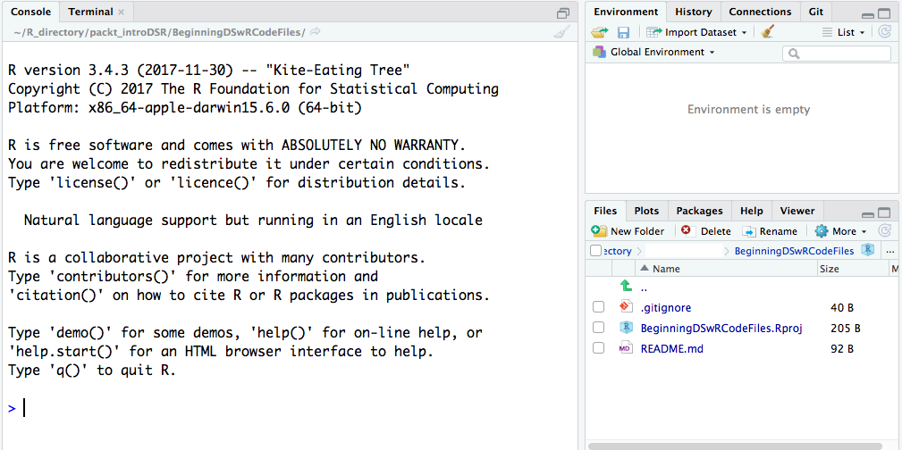
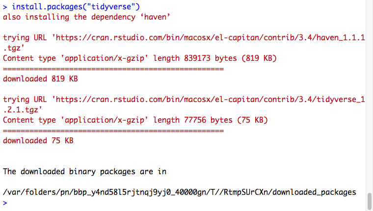
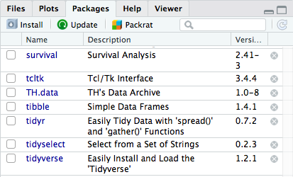
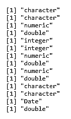
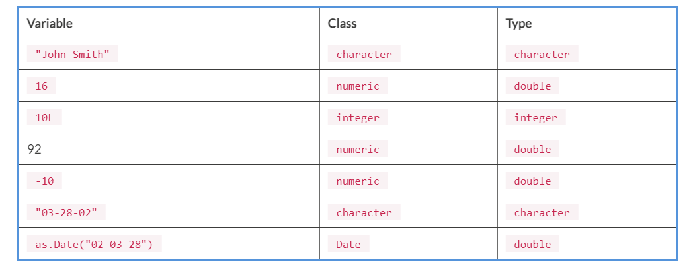
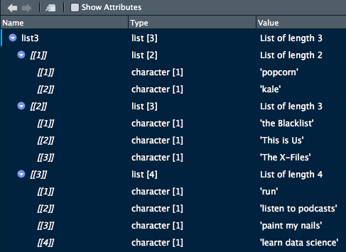

 Solutions
-----------


This section contains the worked-out answers for the activities present
in each lesson. Note that in case of descriptive questions, your answers
might not match the ones provided in this section completely. As long as
the essence of the answers remain the same, you can consider them
correct.


Lab 1: Introduction to R
-----------------------------------------------


The following are the activity solutions for this lab.


### Activity: Installing the Tidyverse Packages


1.  Open the project we created in the subtopic [*Using R and RStudio*] called `IntroToDSwRCourse`. You will
    see the following screen:





2.  Create another new R script, using
    either **`File`** \| **`New File`** \| **`R Script`**, or by
    clicking the top - left button that looks like a piece of white
    paper with a green arrow over it, and selecting **`R Script`**.
3.  In the new script,
    type `install.packages("tidyverse")` and click **`Run`**,
    or use [*Ctrl*] + [*Enter*]. You should now
    see something along the lines of the following screenshot in the
    console. Also, if you scroll through the packages in the lower right
    corner, Tidyverse will now be listed among them:





4.  The graphical user interface lists the packages that are installed
    on your machine in the **`Packages`** tab, as follows:





5.  Save this R script with the name `install_packages`. You
    can save R scripts by either navigating
    to **`File`** \| **`Save As`** or by
    hitting [*Ctrl*] + [*S*] (or [*cmd*] + [*S*],
    on a macOS). It is now saved in your working directory
    as `install_packages.R`.
6.  Load the `ggplot2` package with the
    code `library(ggplot2)`. `ggplot2` is a package
    contained in the `tidyverse` set of packages.
7.  Load the `msleep` dataset by
    using `data("msleep")`. Examine the variables in this
    dataset by using `str(msleep)`.
8.  Save a copy of the global environment to the working directory.


**Note:**

When you install a package, installation-related text will print to your
console in red. This doesn\'t mean that something has gone wrong! Watch
out for the words error or warning. If neither appear, the installation
is fine, despite the red text.


### Activity: Identifying Variable Classes and Types


**Code**:

``` 
class("John Smith")
typeof("John Smith")
...
class(as.Date("02-03-28"))
typeof(as.Date("02-03-28"))
```


**Note:** Solution is available in `R-Programming/lesson1` folder.


**Output**:

The preceding code provides the following output:





 

Thus, the table provided in this scenario can be filed in as follows:



### Activity: Creating Vectors, Lists, Matrices, and Dataframes


1.  Create vectors using the following code:


``` 
vec1 <- c(1:10)
vec2 <- c(LETTERS)
vec3 <- c(1, "A", 2, "B", 3, "C", 4, "D")
```


2.  Create lists using the following code:


``` 
list1 <- list(1:10)
list2 <- list(LETTERS)
list3 <- list(list("popcorn", "kale"), list("the Blacklist", "This is Us", "The X-Files"), list("run", "listen to podcasts", "paint my nails", "learn data science"))
```


3.  When you\'ve created the lists, go and look in the environment and
    hit **`View`** to see the third list. Expand each list in the list
    of lists to see your answers and the types, as shown in the
    following screenshot:





4.  Create matrices using the following code:
    
    a.  Use `cbind()` to combine the vector 1:10 and the
        vector A:Z:
    


``` 
matrix1 <- cbind(vec1, vec2)
```


1.  
    b.  Use the following code to combine these two into a matrix,
        albeit one that will be coerced to character type:
    


``` 
matrix_solution <-cbind(vec1, vec2[1:10]) 
```


3.  Create dataframes using the following code:


``` 
df1 <- as.data.frame(matrix_solution)
df2 <- rbind.data.frame(c(1:5), c(6:10), c(11:15), c(16:20), c(21:25))
names(df2) <- c("one", "two", "three", "four", "five")
```


### Activity: Building Basic Loops


The code we have developed thus far is as follows:

``` 
#load datasets
data("iris")
data("ChickWeight")

# if
var <- 100

  if((var/5) >= 25){
    print("Big number")
  }
...
  }else{
    Diet4 <- rbind(Diet4, ChickWeight[chick,])
  }
}
```


**Note:** Solution is available in `R-Programming/lesson1` folder.


### Activity: Exporting and Importing the mtcars Dataset


1.  Open a new R Script and save it as a file
    called `lesson1_activityD.R`.
2.  Load the `datasets` library, and then
    the `mtcars` dataset with the following code:


``` 
library(datasets)
data("mtcars")
```


3.  View `mtcars` with the `str()` function to see
    the data names, types, and how many observations and variables there
    are. The code will be as follows:


``` 
str(mtcars)
```


4.  Create a variable called `hpcyl`, which is equal to the
    horsepower per cylinders of each car as follows:


``` 
mtcars$hpcyl <- mtcars$hp/mtcars$cyl
```


5.  Write `mtcars` into a `.csv` file
    called `mtcars_out.csv`. If you have a program installed
    that will allow it, open it on your computer and verify that
    the `hpcyl` variable is inside. The code will be as
    follows:


``` 
write.csv(mtcars, "mtcars_out.csv")
```


6.  Read the dataset back in and call it `mtcars_in` by
    using `read.csv()`. The code will be as follows:


``` 
mtcars_in <- read.csv("mtcars_out.csv")
```


### Activity: Exploring the Introduction to dplyr Vignette


**Code**:

``` 
...
filter(flights, month == 1, day == 1)
flights[flights$month == 1 & flights$day == 1, ]
#arrange
arrange(flights, year, month, day)
arrange(flights, desc(arr_delay))
#select
select(flights, year, month, day)
select(flights, year:day)
select(flights, -(year:day))
...
```


**Note:** Solution is available in `R-Programming/lesson1` folder.


Lab 2: Data Visualization and Graphics
-------------------------------------------------------------


The following are the activity solutions for this lab.


### Activity: Recreating Plots with Base Plot Methods


The following code can be used to load the `datasets` library:

``` 
library(datasets)
install.packages("ggplot2")
library(ggplot2)
```


The following code can be used to load the data:

``` 
data("iris")
data("mpg")
```


The following code can be used to create a scatterplot to plot petal
width without an axis label:

``` 
plot(iris$Petal.Width)
```


The following code can be used to create a scatterplot to plot petal
width without axis labels:

``` 
plot(iris$Petal.Width, iris$Petal.Length,
     main = "Petal Length vs. Petal Width",
     xlab = "Petal Width",
     ylab = "Petal Length")
```


The following code can be used to create scatterplots
in [*1x2*] grids to plot petal length and width with axis
labels:

``` 
par(mfrow = c(1,2))
plot(iris$Petal.Width, iris$Petal.Length,
     xlab = "Petal Width",
     ylab = "Petal Length")
plot(iris$Sepal.Width, iris$Sepal.Length,
     xlab = "Sepal Width",
     ylab = "Sepal Length")
dev.off()
```


The following code can be used to create a histogram
using `mtcars` data to plot the number of cylinders in the
color blue:

``` 
plot(as.factor(mpg$cyl),
     col = "blue",
     xlab = "# of cylinders")
```


### Activity: Recreating Plots Using ggplot2


The following code can be used to load the `datasets` library:

``` 
library(ggplot2)
```


The following code can be used to create a histogram to plot petal
width:

``` 
ggplot(iris, aes(Petal.Width)) + geom_histogram(binwidth = 0.5)
```


The following code can be used to create a scatterplot to plot petal
length and width:

``` 
ggplot(iris, aes(Petal.Width, Petal.Length)) + geom_point()
```


The following code can be used to create a boxplot to plot petal length
and the `Species` factor variable:

``` 
ggplot(iris, aes(as.factor(Species), Petal.Width)) + geom_boxplot()
```


The following code can be used to create a bar chart using
the `gear` variable of the `mtcars` dataset:

``` 
ggplot(mtcars, aes(gear)) + geom_bar()
```


### Activity: Utilizing ggplot2 Aesthetics


The following code is used to recreate the various plots using the mpg
and diamonds datasets:

``` 
ggplot(mpg, aes(class)) + geom_bar(fill = "purple")

ggplot(mpg, aes(class, fill = as.factor(drv))) + geom_bar(position = "fill")

#scatter plot
ggplot(diamonds, aes(carat, price, col = cut)) + geom_point(alpha = 0.4)

ggplot(diamonds, aes(carat, price)) + geom_point(shape = 6, alpha = 0.3)
```


Lab 3: Data Management
---------------------------------------------


The following are the activity solutions for this lab.


### Activity: Creating and Manipulating Factor Variables


Use the following code to load the `datasets` library:

``` 
library(datasets)
```


Use the following code to load the `diamonds` dataset:

``` 
data("diamonds")
```


The function `str()` can be used to examine
the `diamonds` dataset as follows:

``` 
str(diamonds)
```


We understand that there are three factors of ordered type as we
examine the `diamonds` dataset. To identify the class of those
factors, we can use the function `class()` as follows:

``` 
class(diamonds$cut)
class(diamonds$color)
class(diamonds$clarity)
```


The following code can be used to load the `midwest` dataset:

``` 
data("midwest")
```


The `str()` function can be used to examine
the `midwest` dataset as follows:

``` 
str(midwest)
```


The following code can be used to convert the character variables into
factor variables using the `apply()` method for changing many
variables at once:

``` 
to.factor <- c("county", "state", "category")
midwest[,to.factor] <- data.frame(apply(midwest[,to.factor], 2, as.factor))
```


We can confirm if the character variables have been converted into the
factor variable using the `str()` method, as follows:

``` 
str(midwest)
```


### Activity: Creating Data Summarization Tables


The following is the code we need to execute to accomplish the activity:

``` 
library(dplyr)
library(datasets)
#below:
table(diamonds$clarity)
table(diamonds$clarity, diamonds$color)
diamonds %>% group_by(clarity) %>% summarise(median(depth))
```


### Activity: Implementing Data Summary


The following code can be used to load the `mtcars` dataset
and examine it:

``` 
data("mtcars")
str(mtcars)
```


Use the following code to summarize all the variables in
the `mtcars` dataset that are not categorical, and find the
mean and variance of each:

``` 
apply(mtcars[,-c(2,10,11)], 2, function(x) c(mean(x), var(x)))

diamonds %>% group_by(color, clarity) %>% summarise(median(price))
diamonds %>% filter(color != "D" & color != "H") %>% group_
by(color) %>% summarise(median(depth))
```


### Activity: Demonstrating Splitting and Combining Data


1.  Load the `mtcars` dataset using the following code:


``` 
install.packages("datasets")
library(datasets)
data("mtcars")
```


Split the data by the `cyl` variable as follows:

``` 
mtcars_split <- split(mtcars, mtcars$cyl)
```


Create one dataset for each level of `cyl` using the following
code:

``` 
mtcars_4 <- mtcars_split[[1]]
mtcars_6 <- mtcars_split[[2]]
mtcars_8 <- mtcars_split[[3]]
```


Recreate `mtcars` by unsplitting the split version of the data
as follows:

``` 
mtcars_unsplit <- unsplit(mtcars_split, mtcars$cyl)
```


2.  Combine the data using the following code:


``` 
l1 <- letters[1:4]
l2 <- letters[5:8]
l3 <- letters[9:12]
l4 <- letters[13:16]
l5 <- letters[17:20]
```


Create the following
datasets `letters1` and `letters2` as follows:

``` 
letters1 <- rbind.data.frame(l1, l2, l3, l4, l5)
letters2 <- cbind.data.frame(l1, l2, l3, l4, l5)
```


### Activity: Merging and Joining Data


The following is the code we need to execute to accomplish the activity:

``` 
library(readr)
students <- read_csv("https://github.com/fenago/R-Programming/blob/master/lesson1/students.csv")
students$StudentID <- seq(1:nrow(students))

students2 <- data.frame("ID" = seq(1:25),
                        "Gender" = sample(c("M","F"), size = 25, replace = TRUE),
                        "Grade" = sample(c(9,10,11,12), size = 25, replace = TRUE),
                        "Sport" = sample(c("Basketball", "Tennis", "Track", "None"), size = 25, replace = TRUE))

str(students2)
```


**Note:** Solution is available in `R-Programming/lesson3` folder.

